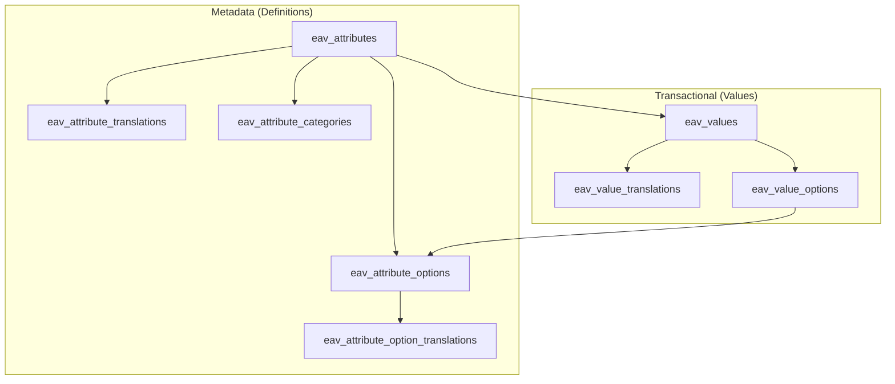

# EAV Architecture

Hybrid Dynamic EAV Engine — metadata tables separated from transactional value tables.

---

## Design principles

1. **Morph alias consistency** — `valuable_type` and `entity_type` use `getMorphClass()` values (`blogs`, not FQCN).
2. **Typed columns** — filterable values stored in indexed typed columns, not a single TEXT field.
3. **Pivot for multi-select** — `eav_value_options` enables fast `IN` queries.
4. **Translation tables** — labels and translatable values follow HMsoft translation patterns.
5. **One value row per attribute** — `UNIQUE (valuable_type, valuable_id, attribute_id)`.

---

## Table groups



---

## Input type → storage mapping

| input_type | value_type | Stored in |
|------------|------------|-----------|
| `text` | `string` | `eav_value_translations.value_text` (translatable) |
| `textarea` | `text` | `eav_value_translations.value_long_text` (translatable) |
| `select`, `radio` | `option` | `eav_values.attribute_option_id` |
| `multi_select`, `checkbox` | `options` | `eav_value_options` pivot |
| `color` | `string` | `eav_values.value_text` (`#RRGGBB`) |
| `number` | `number` | `eav_values.value_number` |
| `date` | `date` | `eav_values.value_date` |
| `boolean` | `boolean` | `eav_values.value_boolean` |

---

## Morph flow

```
Blog (id=15, morph='blogs')
    └── eav_values
            valuable_type = 'blogs'
            valuable_id   = 15
            attribute_id  = 3
            value_number  = 12.500000
```

---

## Category scoping

`eav_attribute_categories` links an attribute definition to categories:

```
attribute_id=5, category_type='blog_categories', category_id=2
```

At sync time, validate the owner belongs to an allowed category (app-level rule).

---

## Soft deletes

`eav_attributes` uses `deleted_at`:

- Existing `eav_values` are preserved (history)
- Attribute hidden from admin UI and new syncs
- Filter keys refreshed via `EavFilterRegistrar::flushEntityCache()`

---

## Performance indexes

Composite indexes on `(attribute_id, value_*)` support AutoFilter joins at scale.

See [DATABASE_SCHEMA.md](./DATABASE_SCHEMA.md) for the full index list.
