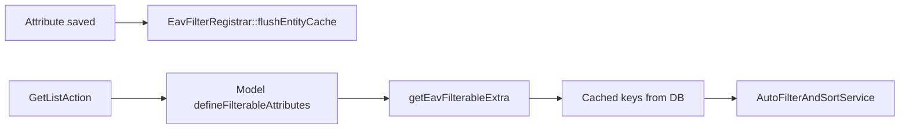

# EAV Filtering (AutoFilter Integration)

How dynamic attribute filters work with `AutoFilterAndSortService`.

---

## Filter key convention

```
{prefix}.{code}
```

Default prefix: `eav` (configurable via `CMS_EAV_FILTER_PREFIX`)

Examples:
- `eav.weight`
- `eav.material`
- `eav.is_featured_custom`

Only attributes with `is_filterable = true` and `is_active = true` are registered.

---

## Registration flow



---

## Model setup

```php
class Blog extends Model implements AutoFilterable
{
    use IsAutoFilterable, HasEavAttributes;

    protected function getFilterableExtra(): array
    {
        return array_merge(parent::getFilterableExtra(), $this->getEavFilterableExtra());
    }

    protected function getSortableExtra(): array
    {
        return array_merge(parent::getSortableExtra(), $this->getEavSortableExtra());
    }
}
```

---

## Custom filter handler (recommended for v1)

`AutoFilterAndSortService` filters columns on the main table by default. EAV requires a join — register a custom handler:

```php
use HMsoft\Tools\Features\Attribute\Models\Attribute;
use HMsoft\Tools\Features\Attribute\Models\EavValue;
use HMsoft\Tools\Features\Attribute\Support\EavConfig;

$handlers = [];

foreach (Attribute::forEntity('blogs')->filterable()->get() as $attr) {
    $key = EavConfig::filterKey($attr->code);

    $handlers[$key] = function ($query, $filter) use ($attr) {
        $alias = 'eav_f_' . $attr->id;

        $query->whereExists(function ($sub) use ($attr, $alias, $filter) {
            $sub->from('eav_values as ' . $alias)
                ->whereColumn($alias . '.valuable_id', 'blogs.id')
                ->where($alias . '.valuable_type', 'blogs')
                ->where($alias . '.attribute_id', $attr->id);

            // Apply typed filter based on value_type
            match ($attr->value_type->value) {
                'number' => $sub->where($alias . '.value_number', $filter->filterFns, $filter->value),
                'boolean' => $sub->where($alias . '.value_boolean', (bool) $filter->value),
                'date' => $sub->whereDate($alias . '.value_date', $filter->filterFns, $filter->value),
                'option' => $sub->where($alias . '.attribute_option_id', $filter->value),
                default => $sub->where($alias . '.value_text', 'like', '%' . $filter->value . '%'),
            };
        });
    };
}

AutoFilterAndSortService::dynamicSearchFromRequest(
    model: Blog::class,
    customFilterHandlers: $handlers,
);
```

---

## Multi-select filter

For `value_type = options`, join the pivot:

```php
$sub->whereExists(function ($pivot) use ($alias, $filter) {
    $pivot->from('eav_value_options')
        ->whereColumn('eav_value_options.value_id', $alias . '.id')
        ->whereIn('eav_value_options.attribute_option_id', (array) $filter->value);
});
```

---

## Sorting by EAV column

Requires custom sort handler (future package enhancement). For now, sort by main table columns or post-process.

Attributes with `is_sortable = true` register keys via `EavFilterRegistrar::sortableKeysForEntity()`.

---

## Global search

Attributes with `is_searchable = true` on translatable text types should join:

```
eav_values → eav_value_translations
```

Search `value_text` and `value_long_text` for current locale.

---

## Performance tips

1. Always filter with `(attribute_id, value_*)` composite indexes
2. Use option pivot `attribute_option_id` index for multi-select
3. Cache filter key registry (`definition_cache_ttl`)
4. Flush cache when definitions change
5. Avoid `LIKE '%x%'` on large text — use fulltext if needed

---

## Phase roadmap

| Phase | Feature |
|-------|---------|
| **v1 (current)** | Filter key registry + manual custom handlers |
| **v2** | Built-in `AppliesEavFilters` concern in DynamicFilters |
| **v3** | Automatic global search joins for searchable attributes |
