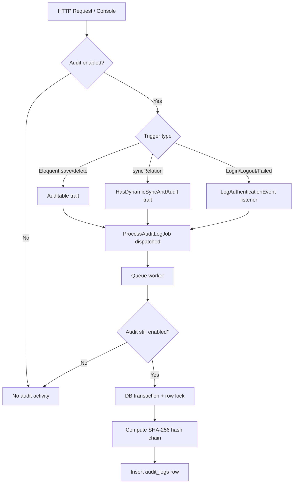

# Audit Architecture

This document explains how the HMsoft Audit feature works internally — from a model save to a tamper-evident ledger row.

---

## Design goals

1. **Accountability** — every CMS change is attributed to a user, IP, session, and user agent.
2. **Immutability** — audit rows are append-only; each row cryptographically links to the previous one.
3. **Tamper detection** — verification commands detect direct database manipulation.
4. **Non-blocking writes** — audit persistence runs on the queue so HTTP requests stay fast.
5. **Explicit control** — the entire system respects `config/cms_audit.php`; nothing runs when disabled.

---

## High-level data flow



---

## The hash chain (genesis block → linked ledger)

Each `audit_logs` row stores:

| Column | Role |
|--------|------|
| `previous_hash` | Hash of the prior row (genesis = 64 zeros) |
| `hash` | SHA-256 of the current payload **including** `previous_hash` |

### Payload hashed (exact field order matters)

```json
{
  "user_id": 1,
  "event": "updated",
  "auditable_type": "blogs",
  "auditable_id": 42,
  "old_values": {"title": "Old"},
  "new_values": {"title": "New"},
  "ip_address": "127.0.0.1",
  "user_agent": "Mozilla/5.0 ...",
  "session_id": "abc123",
  "previous_hash": "000...000"
}
```

The job:

1. Locks the latest row (`lockForUpdate()`) to avoid race conditions under concurrent writes.
2. Reads the previous row's `hash` (or genesis hash if empty table).
3. Builds the JSON payload above.
4. Computes `hash('sha256', $payload)`.
5. Inserts the new row.

**If anyone deletes or edits a row**, the chain breaks and `audit:verify` fails at the first corrupted link.

---

## Database schema

Table: `audit_logs`

| Column | Type | Notes |
|--------|------|-------|
| `id` | bigint | Auto-increment primary key |
| `user_id` | FK → users | Nullable; actor who caused the change |
| `event` | string | `created`, `updated`, `deleted`, `logged_in`, etc. |
| `auditable_type` | string | Morph alias (e.g. `blogs`, `users`) |
| `auditable_id` | bigint | Target record ID |
| `old_values` | json | State before change |
| `new_values` | json | State after change |
| `ip_address` | string(45) | IPv4/IPv6 |
| `user_agent` | text | Client user agent |
| `session_id` | string | Session identifier |
| `previous_hash` | string | Link to prior row |
| `hash` | string (unique) | Current row fingerprint |
| `created_at` | timestamp | Append-only; no `updated_at` |

Index: `(auditable_type, auditable_id)` for per-record lookups.

---

## Component responsibilities

### `Auditable` trait

Registers Eloquent listeners on boot (only when `AuditConfig::shouldLogModelEvents()` is true):

| Event | `old_values` | `new_values` |
|-------|--------------|--------------|
| `created` | `[]` | Full model array |
| `updated` | Changed columns (original) | Changed columns (new) |
| `deleted` | Full model array | `[]` |

Hidden attributes (`$hidden`) are stripped before dispatch.

### `HasDynamicSyncAndAudit` trait

Provides `syncRelation()` for:

- **BelongsToMany** — uses `sync()` on pivot data
- **HasMany** — uses `updateOrCreate` + deletes removed rows

When the relation snapshot changes, it dispatches one audit job with the parent model attributes merged with the relation key:

```php
[
  ...parentAttributes,
  'pricings' => [ /* relation rows */ ]
]
```

### `LogAuthenticationEvent` listener

Maps Laravel auth events:

| Event | Audit `event` | `new_values` |
|-------|---------------|--------------|
| `Login` | `logged_in` | `[]` |
| `Logout` | `logged_out` | `[]` |
| `Failed` | `login_failed` | `{ attempted_email }` — **never logs password** |

Uses hard-coded morph alias `'users'` and `auditable_id` of `0` when user is unknown.

### `ProcessAuditLogJob`

- Implements `ShouldQueue` — **requires a running queue worker**.
- Early-returns if audit is disabled at processing time (handles jobs queued before disable).
- Uses a DB transaction with pessimistic locking on the latest row.

### `AuditServiceProvider`

| Boot step | Gated by |
|-----------|----------|
| Merge / publish config | Always |
| Load migrations | `shouldLoadMigrations()` |
| Register `/api/audit` routes | `shouldRegisterRoutes()` |
| Register `audit_log` morph alias | `isEnabled()` |
| Scan `app/Features/**/Models` for morph map | Always (when provider boots) |
| Register Artisan commands | `isEnabled()` + console |
| Register auth event listeners | `shouldLogAuthentication()` |

### Morph map (dynamic model discovery)

On boot, the provider scans:

```
app/Features/**/Models/*.php
```

For each Eloquent model it registers:

```
alias => App\Features\...\ModelClass
```

**Alias resolution order:**

1. `$model->getMorphClass()` if overridden and different from FQCN
2. Otherwise `$model->getTable()`

The map is cached forever under key `system_morph_map` (skipped when DB cache table is unavailable).

**After adding a new audited model**, run:

```bash
php artisan cache:clear
```

---

## Event types reference

| Event | Source | Description |
|-------|--------|-------------|
| `created` | `Auditable` | New model row |
| `updated` | `Auditable` / `HasDynamicSyncAndAudit` | Field or relation change |
| `deleted` | `Auditable` | Model soft/hard delete |
| `logged_in` | Auth listener | Successful login |
| `logged_out` | Auth listener | Logout |
| `login_failed` | Auth listener | Failed credential attempt |

---

## Security model (Zero-Trust assumptions)

The system assumes:

- Application code may be bypassed via raw SQL
- Database admins may attempt cover-ups
- Audit tables themselves may be targeted

Therefore:

- **Ledger integrity** is verified independently (`audit:verify`)
- **Live data vs ledger** is cross-checked (`audit:state-match`)
- **Queue processing** ensures hash ordering under concurrency

---

## What audit does NOT cover

| Scenario | Result |
|----------|--------|
| `DB::table()->update()` | No audit row |
| `Model::withoutEvents()` | No audit row |
| Audit disabled in config | No listeners, jobs, routes, or migrations |
| Queue worker stopped | Jobs pile up; ledger falls behind (not lost if queue persists) |
| Models without `Auditable` trait | No automatic model event logging |

See [DEVELOPER_GUIDE.md](./DEVELOPER_GUIDE.md) for how to audit new domains correctly.
