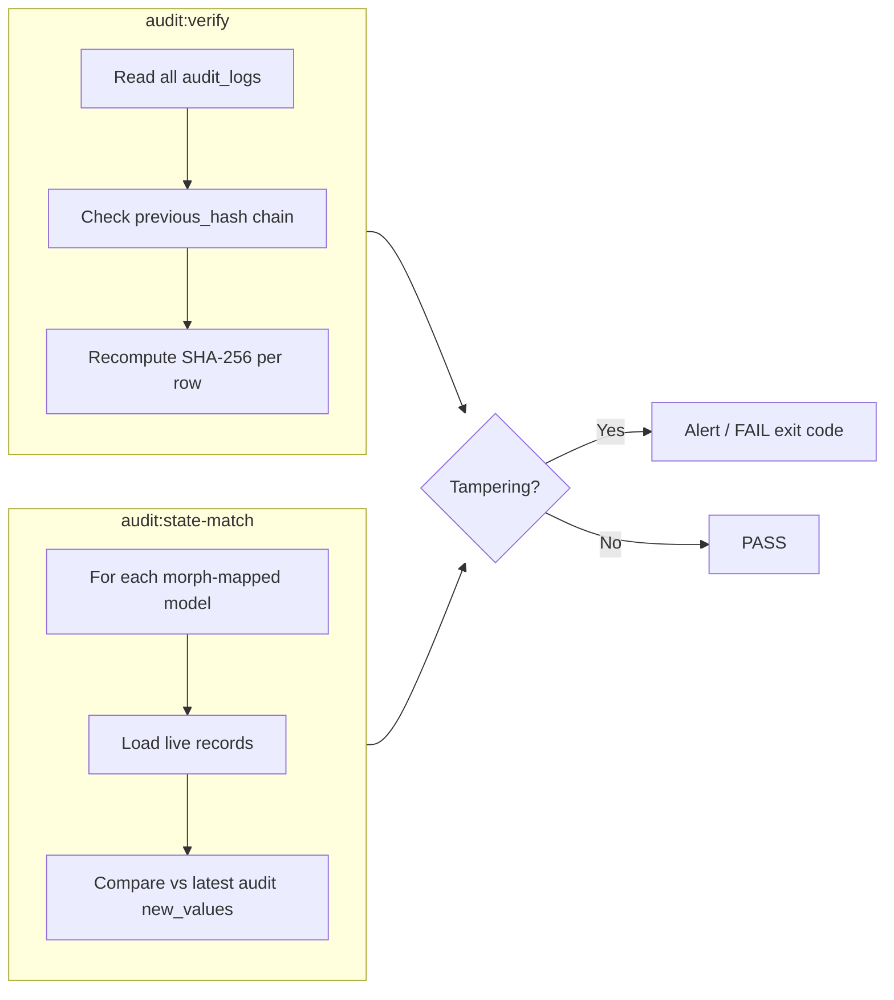

# Audit Verification

Two Artisan commands detect tampering: one validates the **ledger chain**, the other validates **live database state** against the ledger.

Both require:

- `CMS_AUDIT_ENABLED=true`
- `audit_logs` table populated
- Queue worker has processed pending audit jobs

---

## Command overview

| Command | Purpose | Speed | Detects |
|---------|---------|-------|---------|
| `audit:verify` | Hash chain integrity | Fast | Deleted/modified ledger rows |
| `audit:state-match` | DB vs ledger comparison | Slow (full scan) | Raw SQL bypass on business tables |

---

## `audit:verify` — Ledger integrity

```bash
php artisan audit:verify
```

### Algorithm

1. Load all `audit_logs` rows ordered by `id ASC`
2. Start with genesis hash: `str_repeat('0', 64)`
3. For each row:
   - Assert `previous_hash` matches expected link
   - Rebuild JSON payload with exact field order
   - Recompute SHA-256 and compare to stored `hash`
   - Set expected hash to current row's `hash` for next iteration

### Success output

```
✅ Ledger integrity verified. 0 tampered records found.
```

### Failure examples

```
🚨 CRITICAL: Chain broken at Audit ID: 42. A previous record was deleted!
🚨 CRITICAL: Data Tampering detected at Audit ID: 42!
```

Exit code: `FAILURE` (1) when tampering detected.

### When to run

| Environment | Recommended schedule |
|-------------|---------------------|
| Production | Hourly via Laravel Scheduler |
| CI/CD | After deploy or nightly |
| Manual | After suspected breach |

---

## `audit:state-match` — Database state cross-check

```bash
php artisan audit:state-match
```

### Algorithm

1. Read all entries from `Relation::morphMap()`
2. For each model alias:
   - Skip if table does not exist
   - Chunk records (500 per batch)
   - For each record:
     - Find latest `audit_logs` row for `(auditable_type, auditable_id)`
     - Warn if no log exists (possible raw INSERT)
     - Error if latest event is `deleted` but row still exists (ghost restore)
     - Compare each column in `new_values` against live DB state

### Comparison rules

| Value type | Comparison method |
|------------|-------------------|
| Scalar columns | Raw DB value vs ledger value (string cast) |
| JSON/array columns | Normalized JSON comparison |
| Eloquent relations (by method name) | Fetches live relation data vs ledger snapshot |
| Enums | Resolved to backed value or name |

### Success output

```
✅ State-match verified. All database records perfectly match the cryptographic ledger.
```

### Warning (non-fatal)

```
⚠️  WARNING: No audit log exists for blogs ID: 7. Was this created via raw SQL?
```

Warnings do not fail the command but indicate records outside the audit trail.

### Failure examples

```
🚨 CRITICAL: blogs ID: 3 exists in the database, but the ledger says it was DELETED!
🚨 CRITICAL TAMPERING DETECTED on gold_prices ID: 12!
   Column 'buy' was altered bypassing the application.
```

Exit code: `FAILURE` (1) when critical mismatches found.

### When to run

| Environment | Recommended schedule |
|-------------|---------------------|
| Production | Daily off-peak (e.g. 03:00) |
| After bulk imports | Manual run |
| Compliance audits | On demand |

---

## Recommended scheduler setup

Add to your app's `routes/console.php`:

```php
use Illuminate\Support\Facades\Schedule;

Schedule::command('audit:verify')->hourly();
Schedule::command('audit:state-match')->dailyAt('03:00');
```

Ensure cron runs Laravel scheduler:

```bash
* * * * * cd /path-to-project && php artisan schedule:run >> /dev/null 2>&1
```

---

## Verification workflow diagram



---

## Interpreting results

| Finding | Likely cause | Action |
|---------|--------------|--------|
| Chain broken | Deleted audit row | Investigate DB access logs |
| Hash mismatch | Edited audit row content | Treat as security incident |
| Ghost record (deleted in ledger, exists in DB) | Raw INSERT/RESTORE | Restore from backup or re-delete via app |
| Column mismatch | Raw UPDATE | Reconcile data; investigate access |
| No audit log warning | Pre-audit data or raw INSERT | Backfill or accept gap |

---

## Limitations

- **State-match** compares against the **latest** audit entry per record — intermediate states are not re-validated.
- Records created before audit was enabled may trigger "no audit log" warnings.
- Models not in the morph map are skipped entirely.
- Relation comparison normalizes array order — order-only differences are ignored.

---

## CI integration example

```yaml
# .github/workflows/audit-verify.yml
- name: Verify audit ledger
  run: php artisan audit:verify

- name: Verify database state
  run: php artisan audit:state-match
```

Run only on environments with a populated audit ledger.
