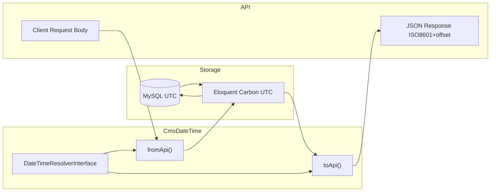

# CmsDateTime — Complete Reference

> **Namespace:** `HMsoft\Tools\Features\DateTime\Support\CmsDateTime`  
> **Package:** `hmsoft/tools` → `Features/DateTime`  
> **Config:** `config/cms_datetime.php`  
> **Version:** HMsoft Tools DateTime Feature

This document is the **authoritative reference** for `CmsDateTime` and the DateTime feature. Use it for implementation, debugging, and onboarding.

---

## Table of Contents

1. [Overview](#1-overview)
2. [Design Principles](#2-design-principles)
3. [Architecture](#3-architecture)
4. [Configuration Reference](#4-configuration-reference)
5. [Timezone Resolvers](#5-timezone-resolvers)
6. [CmsDateTime API](#6-cmsdatetime-api)
7. [DateTimeConfig API](#7-datetimeconfig-api)
8. [Automatic Integrations](#8-automatic-integrations)
9. [HTTP API Endpoints](#9-http-api-endpoints)
10. [Input & Output Rules](#10-input--output-rules)
11. [Usage Patterns](#11-usage-patterns)
12. [Custom Timezone Recipes](#12-custom-timezone-recipes)
13. [Package File Map](#13-package-file-map)
14. [Troubleshooting](#14-troubleshooting)
15. [Anti-Patterns](#15-anti-patterns)
16. [Quick Reference Card](#16-quick-reference-card)

---

## 1. Overview

`CmsDateTime` is the central utility for **timezone-safe datetime handling** in HMsoft CMS APIs.

| Concern | Strategy |
|---------|----------|
| **Storage** | UTC (or `APP_TIMEZONE`) in database and Eloquent |
| **API output** | Resolved API timezone (e.g. `Asia/Damascus`) as ISO8601 with offset |
| **API input** | Parsed in API timezone, converted to UTC for storage |
| **Customization** | Config, callback, or resolver class — **no built-in user/column logic** |

### Problem It Solves

Without a single convention, APIs often mix:

- Raw `toDateTimeString()` (no offset, ambiguous timezone)
- Server-local PHP timezone
- UTC strings that clients misread as local time

`CmsDateTime` enforces one rule: **store UTC, return localized ISO8601**.

### Example

```php
use HMsoft\Tools\Features\DateTime\Support\CmsDateTime;

// DB value (UTC): 2026-07-19 06:30:00
CmsDateTime::toApi($model->created_at);
// → "2026-07-19T09:30:00+03:00"  (Asia/Damascus)
```

---

## 2. Design Principles

1. **User-agnostic** — The package never reads `users`, auth, or specific columns. Your app supplies timezone logic via callback or class.
2. **Tools, not policy** — `CmsDateTime` converts datetimes; *you* decide where the timezone comes from.
3. **UTC storage** — Database and Eloquent should use UTC (`APP_TIMEZONE=UTC`, `DB_TIMEZONE=+00:00`).
4. **Explicit API format** — Output is always ISO8601 with timezone offset (`DATE_ATOM` / `toIso8601String()`).
5. **Date-only preservation** — Values like `1990-05-15` are never shifted (no time component = no TZ conversion).

---

## 3. Architecture

### Data Flow



### Resolution Chain

When `CmsDateTime::apiTimezone()` is called:

```
1. DateTimeResolverInterface (singleton)
   ├── config   → ConfigDateTimeResolver → APP_API_TIMEZONE
   ├── callback → CallbackDateTimeResolver → your registered callback → fallback APP_API_TIMEZONE
   └── class    → your DateTimeResolverInterface implementation
2. Used by toApi(), fromApi(), nowApi(), transformArray(), HTTP /convert
```

### Layers Covered Automatically

| Layer | Mechanism |
|-------|-----------|
| Eloquent `Model::toArray()` / JSON | `Date::serializeUsing()` → `CmsDateTime::toApi()` |
| Carbon instances | `$date->toApi()` macro |
| Spatie Laravel Data `DateTime` properties | `CmsDateTimeTransformer` + `CmsDateTimeCast` |
| Audit log payloads | `AuditLogData` uses `toApi()` + `transformArray()` |
| Manual string fields in Data DTOs | Call `CmsDateTime::toApi()` explicitly |

---

## 4. Configuration Reference

### Config File: `config/cms_datetime.php`

| Key | Type | Default | Description |
|-----|------|---------|-------------|
| `enabled` | bool | `true` | Master switch. When `false`, no routes or serialization hooks. |
| `register_routes` | bool | `true` | Register `/api/datetime/*` endpoints. |
| `storage_timezone` | string | `UTC` | Timezone for DB storage. Maps to `APP_TIMEZONE`. |
| `api_timezone` | string | `Asia/Damascus` | Default/fallback API output timezone. Maps to `APP_API_TIMEZONE`. |
| `resolver` | string | `config` | `config`, `callback`, or `class` (alias: `custom`). |
| `resolver_class` | string\|null | `null` | FQCN when `resolver=class`. |
| `date_format` | string | `DATE_ATOM` | Spatie Laravel Data date format constant. |

### Environment Variables

| Variable | Required | Default | Description |
|----------|----------|---------|-------------|
| `APP_TIMEZONE` | No | `UTC` | PHP/Laravel app timezone (= storage) |
| `APP_API_TIMEZONE` | No | `Asia/Damascus` | Default API output timezone |
| `CMS_DATETIME_ENABLED` | No | `true` | Enable/disable feature |
| `CMS_DATETIME_REGISTER_ROUTES` | No | `true` | HTTP debug endpoints |
| `CMS_DATETIME_RESOLVER` | No | `config` | `config` \| `callback` \| `class` |
| `CMS_DATETIME_RESOLVER_CLASS` | When `class` | — | Custom resolver FQCN |
| `DB_TIMEZONE` | No | `+00:00` | MySQL session TZ (`config/database.php`) |

### Publish Config

```bash
php artisan vendor:publish --tag=cms-datetime-config
```

### Related App Config (this project)

| File | Keys |
|------|------|
| `config/app.php` | `timezone`, `api_timezone` |
| `config/database.php` | `connections.mysql.timezone`, `connections.mariadb.timezone` |

### Recommended `.env` (Syria single-region)

```env
APP_TIMEZONE=UTC
APP_API_TIMEZONE=Asia/Damascus
DB_TIMEZONE=+00:00

CMS_DATETIME_ENABLED=true
CMS_DATETIME_REGISTER_ROUTES=true
CMS_DATETIME_RESOLVER=config
```

---

## 5. Timezone Resolvers

### 5.1 `config` (default)

Always returns `api_timezone`. No runtime logic.

```env
CMS_DATETIME_RESOLVER=config
APP_API_TIMEZONE=Asia/Damascus
```

**Class:** `HMsoft\Tools\Features\DateTime\Resolvers\ConfigDateTimeResolver`

---

### 5.2 `callback`

Register a callable in `AppServiceProvider::boot()` **before** requests are handled.

```php
use HMsoft\Tools\Features\DateTime\Support\CmsDateTime;
use HMsoft\Tools\Features\DateTime\Support\DateTimeConfig;

CmsDateTime::resolveApiTimezoneUsing(function (): ?string {
    $tz = /* your logic */;

    if (is_string($tz) && DateTimeConfig::isValidTimezone($tz)) {
        return $tz;
    }

    return null; // → falls back to APP_API_TIMEZONE
});
```

```env
CMS_DATETIME_RESOLVER=callback
```

| Callback return | Result |
|-----------------|--------|
| Valid TZ string (e.g. `Europe/London`) | Used as API timezone |
| `null`, `''`, invalid string | Falls back to `APP_API_TIMEZONE` |

**Class:** `HMsoft\Tools\Features\DateTime\Resolvers\CallbackDateTimeResolver`

**Error:** If `resolver=callback` but no callback registered → `RuntimeException` on first `apiTimezone()` call.

---

### 5.3 `class`

Implement `DateTimeResolverInterface`:

```php
namespace App\Support;

use HMsoft\Tools\Features\DateTime\Contracts\DateTimeResolverInterface;
use HMsoft\Tools\Features\DateTime\Support\DateTimeConfig;

final class AppDateTimeResolver implements DateTimeResolverInterface
{
    public function apiTimezone(): string
    {
        // Read settings table, cache, tenant, header, etc.
        return DateTimeConfig::defaultApiTimezone();
    }
}
```

```env
CMS_DATETIME_RESOLVER=class
CMS_DATETIME_RESOLVER_CLASS=App\Support\AppDateTimeResolver
```

> `CMS_DATETIME_RESOLVER=custom` is accepted as an alias for `class`.

**Interface:**

```php
interface DateTimeResolverInterface
{
    public function apiTimezone(): string;
}
```

---

## 6. CmsDateTime API

**Import:**

```php
use HMsoft\Tools\Features\DateTime\Support\CmsDateTime;
```

### 6.1 `toApi(DateTimeInterface|string|null $value): ?string`

Convert a stored (UTC) datetime to API timezone ISO8601 string.

| Parameter | Description |
|-------------|-------------|
| `$value` | `Carbon`, `DateTime`, ISO string, or `null` |

| Return | Meaning |
|--------|---------|
| `null` | Input was `null` or empty string |
| `"1990-05-15"` | Date-only string — returned unchanged |
| `"2026-07-19T09:30:00+03:00"` | Normal datetime output |

```php
CmsDateTime::toApi($model->created_at);
CmsDateTime::toApi('2026-07-19 06:30:00'); // parsed as storage TZ
CmsDateTime::toApi(null);                    // null
CmsDateTime::toApi('2026-07-19');            // date-only, unchanged
```

**Used for:** API responses, audit fields, dashboard timestamps, any manual DTO string field.

---

### 6.2 `fromApi(DateTimeInterface|string $value): Carbon`

Parse client/API input in the **resolved API timezone** and return a **Carbon in storage timezone (UTC)**.

| Input type | Behavior |
|------------|----------|
| Date-only `Y-m-d` | Start of day in API TZ → converted to UTC |
| Datetime string / object | Parsed in API TZ → shifted to storage TZ |

```php
$model->published_at = CmsDateTime::fromApi($request->input('published_at'));
$model->save();
```

---

### 6.3 `apiTimezone(): string`

Returns the **currently resolved** API output timezone for this request/context.

```php
CmsDateTime::apiTimezone(); // "Asia/Damascus"
```

Delegates to `DateTimeResolverInterface`.

---

### 6.4 `storageTimezone(): string`

Returns configured storage timezone (typically `UTC`).

```php
CmsDateTime::storageTimezone(); // "UTC"
```

---

### 6.5 `nowUtc(): Carbon`

Current time in storage timezone.

```php
CmsDateTime::nowUtc()->toIso8601String();
// "2026-07-19T06:30:00+00:00"
```

---

### 6.6 `nowApi(): Carbon`

Current time in resolved API timezone.

```php
CmsDateTime::nowApi()->toIso8601String();
// "2026-07-19T09:30:00+03:00"
```

---

### 6.7 `transformArray(?array $data): ?array`

Recursively walks an array and converts values whose **string keys end with `_at`**.

| Key | Value | Result |
|-----|-------|--------|
| `created_at` | datetime | `toApi()` applied |
| `published_at` | datetime | `toApi()` applied |
| `birth_date` | `1990-05-15` | unchanged (not `_at` suffix rule — key doesn't end with `_at` in typical usage; if key were `birth_at` with date-only, still skipped by date-only check) |
| `expires_at` | datetime | converted |
| nested arrays | — | recursed |

```php
CmsDateTime::transformArray($auditLog->old_values);
CmsDateTime::transformArray($auditLog->new_values);
```

**Used by:** `AuditLogData` for nested change payloads.

---

### 6.8 `resolveApiTimezoneUsing(callable $callback): void`

Register the callback resolver. Call once in `AppServiceProvider::boot()`.

```php
CmsDateTime::resolveApiTimezoneUsing(fn (): ?string => Cache::get('api_tz'));
```

| Parameter | Type | Description |
|-----------|------|-------------|
| `$callback` | `callable(): ?string` | Returns timezone identifier or null |

---

### 6.9 `hasApiTimezoneCallback(): bool`

Returns whether a callback has been registered.

```php
if (CmsDateTime::hasApiTimezoneCallback()) { ... }
```

---

### 6.10 `resolveApiTimezone(): ?string` *(internal)*

Invokes the registered callback. Used by `CallbackDateTimeResolver`. Prefer `apiTimezone()` in application code.

---

### 6.11 Carbon Macro: `$date->toApi()`

Registered by `DateTimeServiceProvider` when feature is enabled.

```php
$model->created_at->toApi();
// equivalent to CmsDateTime::toApi($model->created_at)
```

---

## 7. DateTimeConfig API

**Import:** `HMsoft\Tools\Features\DateTime\Support\DateTimeConfig`

| Method | Returns | Description |
|--------|---------|-------------|
| `isEnabled()` | `bool` | Feature enabled |
| `shouldRegisterRoutes()` | `bool` | Routes should register |
| `storageTimezone()` | `string` | Storage TZ from config |
| `defaultApiTimezone()` | `string` | Fallback API TZ |
| `resolver()` | `string` | Active resolver mode |
| `resolverClass()` | `?string` | Custom class FQCN |
| `dateFormat()` | `string` | Spatie date format |
| `isValidTimezone(string $tz)` | `bool` | Validates PHP timezone identifier |

```php
DateTimeConfig::isValidTimezone('Asia/Damascus'); // true
DateTimeConfig::isValidTimezone('Invalid/Zone');  // false
```

---

## 8. Automatic Integrations

### 8.1 Eloquent JSON Serialization

When `CMS_DATETIME_ENABLED=true`:

```php
Date::serializeUsing(fn (DateTimeInterface $date) => CmsDateTime::toApi($date) ?? '');
```

Any model datetime in `toArray()` / `toJson()` is converted automatically.

### 8.2 Spatie Laravel Data

`DateTimeServiceProvider` registers:

```php
'data.casts.' . DateTimeInterface::class => CmsDateTimeCast::class,           // input: API → UTC
'data.transformers.' . DateTimeInterface::class => CmsDateTimeTransformer::class, // output: UTC → API
```

**Class:** `HMsoft\Tools\Features\DateTime\Transformers\CmsDateTimeTransformer`

All `DateTime` / `DateTimeInterface` properties in Spatie Data objects (e.g. `created_at`, `updated_at`) are serialized through `CmsDateTime::toApi()` automatically.

**In Data classes — preferred pattern:**

```php
public readonly ?\DateTime $created_at,
public readonly ?\DateTime $updated_at,
```

Spatie handles output transformation. For **string-typed** datetime fields, call `CmsDateTime::toApi()` manually in `fromModel()`.

### 8.3 CmsDateTimeCast

**Class:** `HMsoft\Tools\Features\DateTime\Casts\CmsDateTimeCast`

Parses incoming request datetimes in API timezone, stores as UTC. Extends Spatie `DateTimeInterfaceCast`.

### 8.4 Audit Logs

**Storage (UTC):** `Auditable` trait uses `AuditValueNormalizer` so `old_values` / `new_values` store datetime fields as UTC ISO8601.

**API output:** `AuditLogData` applies:

```php
created_at: CmsDateTime::toApi($log->created_at),
old_values: CmsDateTime::transformArray($log->old_values),
new_values: CmsDateTime::transformArray($log->new_values),
```

Keys ending in `_at` inside nested audit payloads are converted. Add extra keys via `cms_datetime.transform_keys` config.

### 8.5 App Backward-Compat Wrapper

**This project:** `App\Support\ApiDateTime` (deprecated) delegates to `CmsDateTime`.

```php
// Legacy (still works)
App\Support\ApiDateTime::toApi($date);

// Preferred
CmsDateTime::toApi($date);
```

---

## 9. HTTP API Endpoints

Base prefix: **`/api/datetime`**  
Middleware: `api`  
Auth: **not required**

All responses use `CmsResponse::success()` wrapper:

```json
{ "success": true, "data": { ... } }
```

---

### GET `/api/datetime/config`

Returns configuration and **resolved** API timezone.

**Response `data`:**

| Field | Type | Example |
|-------|------|---------|
| `storage_timezone` | string | `"UTC"` |
| `default_api_timezone` | string | `"Asia/Damascus"` |
| `resolved_api_timezone` | string | `"Asia/Damascus"` |
| `resolver` | string | `"config"` |
| `date_format` | string | `"Y-m-d\\TH:i:sP"` |

**Example:**

```http
GET /api/datetime/config
Accept: application/json
```

```json
{
  "success": true,
  "data": {
    "storage_timezone": "UTC",
    "default_api_timezone": "Asia/Damascus",
    "resolved_api_timezone": "Asia/Damascus",
    "resolver": "config",
    "date_format": "Y-m-d\\TH:i:sP"
  }
}
```

---

### GET `/api/datetime/now`

Current server time in both timezones.

**Response `data`:**

| Field | Type | Example |
|-------|------|---------|
| `storage_timezone` | string | `"UTC"` |
| `api_timezone` | string | `"Asia/Damascus"` |
| `now_utc` | string | `"2026-07-19T06:30:00+00:00"` |
| `now_api` | string | `"2026-07-19T09:30:00+03:00"` |

---

### POST `/api/datetime/convert`

Convert a datetime between storage and API timezone.

**Request body:**

| Field | Type | Required | Values |
|-------|------|----------|--------|
| `value` | string | Yes | Parseable datetime |
| `direction` | string | Yes | `to_api`, `to_storage`, `to_utc` |

| Direction | Meaning |
|-----------|---------|
| `to_api` | UTC/storage → API timezone |
| `to_storage` / `to_utc` | API timezone → UTC/storage |

**Example:**

```http
POST /api/datetime/convert
Content-Type: application/json

{
  "value": "2026-07-19T06:30:00+00:00",
  "direction": "to_api"
}
```

**Response `data`:**

| Field | Type |
|-------|------|
| `input` | string |
| `direction` | string |
| `storage_timezone` | string |
| `api_timezone` | string |
| `result` | string |

---

## 10. Input & Output Rules

### Output Format

- **Format:** ISO8601 with offset (`Carbon::toIso8601String()`)
- **Example:** `2026-07-19T09:30:00+03:00`
- **Never use for API:** `toDateTimeString()`, raw `Y-m-d H:i:s` without offset

### Date-Only Fields

Pattern: `YYYY-MM-DD` (regex `^\d{4}-\d{2}-\d{2}$`)

| Method | Behavior |
|--------|----------|
| `toApi('1990-05-15')` | Returns `"1990-05-15"` unchanged |
| `fromApi('1990-05-15')` | Start of day in API TZ → UTC Carbon |

**Examples:** `birth_date`, calendar dates without time.

### `transformArray()` Key Rule

Only keys ending with **`_at`** are candidates:

| Key | Converted? |
|-----|------------|
| `created_at` | Yes |
| `updated_at` | Yes |
| `published_at` | Yes |
| `read_at` | Yes |
| `expires_at` | Yes |
| `birth_date` | No (suffix rule) |
| `date` | No |

Nested arrays are processed recursively.

### Null & Empty

| Input | `toApi()` result |
|-------|------------------|
| `null` | `null` |
| `''` | `null` |

---

## 11. Usage Patterns

### Pattern A — Spatie Data with `DateTime` type (preferred)

```php
class NewsData extends BaseData
{
    public function __construct(
        public readonly int $id,
        public readonly ?\DateTime $created_at,
        public readonly ?\DateTime $updated_at,
    ) {}

    public static function fromModel(News $news): self
    {
        return new self(
            id: $news->id,
            created_at: $news->created_at,
            updated_at: $news->updated_at,
        );
    }
}
```

### Pattern B — String datetime field in DTO

When the property is `string` (not `DateTime`):

```php
use HMsoft\Tools\Features\DateTime\Support\CmsDateTime;

published_at: CmsDateTime::toApi($news->published_at),
```

### Pattern C — Saving from request

```php
$model->published_at = CmsDateTime::fromApi($data->published_at);
```

### Pattern D — Dashboard / computed timestamps

```php
'generated_at' => CmsDateTime::toApi(now()),
```

### Pattern E — Nested JSON / audit payloads

```php
'metadata' => CmsDateTime::transformArray($model->metadata),
```

---

## 12. Custom Timezone Recipes

### Recipe: Per-user column (`users.timezone`)

*Logic lives in your app, not the package.*

```php
// AppServiceProvider::boot()
CmsDateTime::resolveApiTimezoneUsing(function (): ?string {
    $user = auth()->user();
    $tz = $user?->timezone ?? null;

    return is_string($tz) && DateTimeConfig::isValidTimezone($tz) ? $tz : null;
});
```

```env
CMS_DATETIME_RESOLVER=callback
```

### Recipe: Settings table

```php
final class SettingsDateTimeResolver implements DateTimeResolverInterface
{
    public function apiTimezone(): string
    {
        $tz = DB::table('settings')->where('key', 'timezone')->value('value');

        return is_string($tz) && DateTimeConfig::isValidTimezone($tz)
            ? $tz
            : DateTimeConfig::defaultApiTimezone();
    }
}
```

### Recipe: Request header `X-Timezone`

```php
CmsDateTime::resolveApiTimezoneUsing(function (): ?string {
    $header = request()->header('X-Timezone');

    return is_string($header) && DateTimeConfig::isValidTimezone($header)
        ? $header
        : null;
});
```

### Recipe: Multi-tenant

```php
CmsDateTime::resolveApiTimezoneUsing(function (): ?string {
    $tenant = app(TenantContext::class)->current();
    return $tenant?->timezone;
});
```

---

## 13. Package File Map

```
Features/DateTime/
├── config/cms_datetime.php          Default config (publishable)
├── Casts/CmsDateTimeCast.php        Spatie input cast
├── Contracts/DateTimeResolverInterface.php
├── Controllers/DateTimeController.php
├── Actions/
│   ├── ConvertDateTimeAction.php
│   ├── GetDateTimeConfigAction.php
│   └── GetDateTimeNowAction.php
├── Data/
│   ├── DateTimeConfigData.php
│   ├── DateTimeConvertData.php
│   └── DateTimeNowData.php
├── Providers/DateTimeServiceProvider.php
├── Resolvers/
│   ├── ConfigDateTimeResolver.php
│   └── CallbackDateTimeResolver.php
├── Routes/api.php
├── Support/
│   ├── CmsDateTime.php              ★ Core utility
│   └── DateTimeConfig.php
└── docs/
    ├── REFERENCE.md                 ★ This file
    ├── README.md
    ├── CONFIGURATION.md
    ├── API_REFERENCE.md
    └── DEVELOPER_GUIDE.md
```

---

## 14. Troubleshooting

### API returns UTC instead of Syria time

1. Check `APP_API_TIMEZONE=Asia/Damascus`
2. Check `CMS_DATETIME_ENABLED=true`
3. Run `php artisan config:clear`
4. Verify field uses `CmsDateTime::toApi()` or `DateTime` type — not `toDateTimeString()`

### `RuntimeException: CMS_DATETIME_RESOLVER=callback requires...`

You set `CMS_DATETIME_RESOLVER=callback` but forgot `CmsDateTime::resolveApiTimezoneUsing()` in `AppServiceProvider`.

### Times off by 3 hours

Usually means output is still raw UTC. Ensure `CmsDateTime` is used and `DB_TIMEZONE=+00:00`.

### MySQL stores wrong time

Set in `config/database.php`:

```php
'timezone' => env('DB_TIMEZONE', '+00:00'),
```

### Spatie Data field not converting

- Property must be `DateTime` / `DateTimeInterface` type, **or**
- Manually call `CmsDateTime::toApi()` for `string` properties

### Callback not applied

Register callback in `AppServiceProvider::boot()`, not `register()`. Clear config cache after env changes.

### Debug commands

```bash
php artisan config:clear
php artisan route:list --path=datetime
php artisan tinker
```

```php
>>> CmsDateTime::apiTimezone()
>>> CmsDateTime::toApi(now())
>>> CmsDateTime::storageTimezone()
```

---

## 15. Anti-Patterns

| Don't | Do instead |
|-------|------------|
| `$model->created_at->toDateTimeString()` | `CmsDateTime::toApi($model->created_at)` |
| `$model->created_at->format('Y-m-d H:i:s')` | `CmsDateTime::toApi($model->created_at)` |
| Store API-local time in DB | `CmsDateTime::fromApi()` then save UTC |
| Hardcode `Asia/Damascus` in Data classes | Use `CmsDateTime` (respects resolver) |
| Put user logic inside package | Callback/class resolver in **your app** |
| Convert `birth_date` with timezone | Keep as `Y-m-d` string |
| `date_default_timezone_set()` in controllers | Use config + `CmsDateTime` |

---

## 16. Quick Reference Card

```php
use HMsoft\Tools\Features\DateTime\Support\CmsDateTime;

// Read
CmsDateTime::apiTimezone();           // "Asia/Damascus"
CmsDateTime::storageTimezone();       // "UTC"
CmsDateTime::toApi($dt);              // UTC → API ISO8601
CmsDateTime::nowUtc();                // Carbon UTC now
CmsDateTime::nowApi();                // Carbon API TZ now
CmsDateTime::transformArray($arr);    // recursive _at keys

// Write
CmsDateTime::fromApi($input);         // API → UTC Carbon

// Customize (AppServiceProvider)
CmsDateTime::resolveApiTimezoneUsing(fn (): ?string => /* tz or null */);
```

```env
APP_TIMEZONE=UTC
APP_API_TIMEZONE=Asia/Damascus
CMS_DATETIME_RESOLVER=config|callback|class
```

```http
GET  /api/datetime/config
GET  /api/datetime/now
POST /api/datetime/convert
```

---

## Related Documentation

| Document | Focus |
|----------|-------|
| [README.md](./README.md) | Quick start |
| [CONFIGURATION.md](./CONFIGURATION.md) | Config & resolvers |
| [API_REFERENCE.md](./API_REFERENCE.md) | HTTP endpoints only |
| [DEVELOPER_GUIDE.md](./DEVELOPER_GUIDE.md) | Practical coding guide |

Consuming apps may add a project-specific pointer at `docs/DATETIME.md`.

---

*HMsoft Tools — DateTime Feature Reference*
