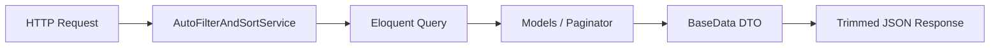

# DynamicFilters

> **HMsoft Tools** — Dynamic query building from URL parameters + JSON response field pruning for Laravel CMS/API projects.

Build secure list endpoints where the frontend controls **filters**, **sorting**, **global search**, **pagination**, and **response shape** — without writing custom query code per resource.

---

## Table of contents

1. [Overview](#overview)
2. [Two parts — what requires what](#two-parts--what-requires-what)
3. [Setup checklist](#setup-checklist)
4. [Backend setup — Auto Filter](#backend-setup--auto-filter)
5. [Backend setup — fields / except](#backend-setup--fields--except)
6. [Usage — Filtering](#usage--filtering)
7. [Usage — Sorting](#usage--sorting)
8. [Usage — Global search](#usage--global-search)
9. [Usage — Advanced filters](#usage--advanced-filters)
10. [Usage — Pagination](#usage--pagination)
11. [Usage — fields & except (JSON pruning)](#usage--fields--except-json-pruning)
12. [Frontend integration](#frontend-integration)
13. [Filter operators reference](#filter-operators-reference)
14. [Custom scopes & hooks](#custom-scopes--hooks)
15. [Architecture summary](#architecture-summary)
16. [Troubleshooting](#troubleshooting)
17. [Extended documentation](#extended-documentation)
18. [Relation support matrix](#relation-support-matrix)
19. [Configuration](#configuration)

---

## Overview

| Capability | Class | Query params |
|------------|-------|--------------|
| **Auto Filter & Sort** | `AutoFilterAndSortService` | `filters`, `sorting`, `globalFilter`, `page`, `perPage`, `advanceFilter` |
| **Response field pruning** | `BaseData` | `fields`, `except` |



**Typical request:**

```http
GET /api/blogs?page=1&perPage=10&globalFilter=news
    &filters=eyJ...&sorting=eyJ...
    &fields=id,title,category.name&except=translations
```

---

## Two parts — what requires what

DynamicFilters is **two independent features** that work together:

| | Part A: Auto Filter | Part B: fields / except |
|---|---------------------|-------------------------|
| **Purpose** | Build SQL from URL | Shrink JSON response |
| **Model + `IsAutoFilterable`** | ✅ Required | ❌ Not needed |
| **`GetListAction`** | ✅ Required | ❌ Not needed |
| **`{Feature}Data extends BaseData`** | ❌ Not needed | ✅ **Required** |
| **`filterableCollect()` in controller** | ❌ Not needed | ✅ **Required** (list) |
| **Nested Data extends `BaseData`** | ❌ Not needed | ✅ Required for nested pruning |

> You can use **Part A alone** (full JSON, dynamic queries).  
> **Part B does not work** without a Data class extending `BaseData`.

---

## Setup checklist

Copy this when adding DynamicFilters to a new resource:

```
Part A — Auto Filter (filters, sort, search, pagination)
[ ] 1. Model implements AutoFilterable
[ ] 2. Model uses IsAutoFilterable trait
[ ] 3. Model: getRelationshipsExtra()
[ ] 4. Model: getFilterableExtra()
[ ] 5. Model: getSortableExtra()
[ ] 6. Model: getFieldSelectionMapExtra() (optional, for relation aliases)
[ ] 7. Model: defineGlobalSearchRelatedAttributes() (optional)
[ ] 8. Create GetListAction → dynamicSearchFromRequest()
[ ] 9. Service::list() returns GetListAction result

Part B — fields / except (JSON response trimming)
[ ] 10. Create {Feature}Data extends BaseData
[ ] 11. Add fromModel() mapping all response properties
[ ] 12. Nested relation Data classes extend BaseData (if using nested fields/except)
[ ] 13. Controller index: {Feature}Data::filterableCollect($result['data'])
[ ] 14. Controller show: {Feature}Data::fromModel() (fields/except auto-applied)
```

### Required vs optional — quick table

| Step | Auto Filter | fields / except |
|------|:-----------:|:---------------:|
| Model + `IsAutoFilterable` | **Required** | — |
| `getFilterableExtra()` etc. | Recommended | — |
| `GetListAction` | **Required** | — |
| `{Feature}Data extends BaseData` | — | **Required** |
| `filterableCollect()` | — | **Required** (list) |
| Nested `CategoryData extends BaseData` | — | If nested pruning |
| `getFieldSelectionMapExtra()` | Optional (DB `fields`) | Uses Data property names |

---

## Backend setup — Auto Filter

### Step 1 — Model

```php
use HMsoft\Tools\Features\DynamicFilters\Contracts\AutoFilterable;
use HMsoft\Tools\Features\DynamicFilters\Traits\IsAutoFilterable;

class Blog extends Model implements AutoFilterable
{
    use IsAutoFilterable;

    public const DEFAULT_INCLUDES = [
        'translations',
        'categories.translations',
        'sector.translations',
    ];
}
```

The trait auto-discovers table columns and excludes sensitive fields (`password`, `api_token`, etc.).

### Step 2 — Configure whitelists

```php
public function getRelationshipsExtra(): array
{
    return [
        'translations' => 'translations',
        'translation'  => 'translation',
        'categories'   => 'categories',
        'sector'       => 'sector',
    ];
}

public function getFilterableExtra(): array
{
    return [
        'translation.title',
        'is_active',
        'published_at',
        'sector_id',
    ];
}

public function getSortableExtra(): array
{
    return [
        'translation.title',
        'published_at',
        'created_at',
    ];
}

public function getFieldSelectionMapExtra(): array
{
    return [
        'title'       => 'translation.title',
        'content'     => 'translation.content',
        'category_id' => 'categories.id',
        'image_url'   => 'image',
    ];
}

public function defineGlobalSearchRelatedAttributes(): array
{
    return [
        'translation' => ['title', 'short_content', 'content'],
    ];
}
```

### Step 3 — GetListAction

```php
use App\Features\Blog\Blog\Models\Blog;
use HMsoft\Tools\Features\DynamicFilters\Services\AutoFilterAndSortService;

class GetListAction
{
    public function execute(): array
    {
        return AutoFilterAndSortService::dynamicSearchFromRequest(
            model: Blog::class,
            extraOperation: function (\Illuminate\Database\Eloquent\Builder &$query) {
                $query->with(Blog::DEFAULT_INCLUDES);
            },
        );
    }
}
```

### Step 4 — Service

```php
public function list(): array
{
    return app(GetListAction::class)->execute();
    // Returns: ['data' => Paginator|Collection, 'pagination' => array|null]
}
```

---

## Backend setup — fields / except

### Step 1 — Create Data class (required)

Property names **must match** what you pass in `?fields=` / `?except=`.

```php
use HMsoft\Tools\Features\DynamicFilters\Data\BaseData;
use Spatie\LaravelData\Lazy;

class BlogData extends BaseData
{
    public function __construct(
        public readonly ?int $id,
        public readonly ?string $title,
        public readonly ?bool $is_active,
        public readonly array $translations,
        public readonly Lazy|SectorData|null $sector,
        public readonly Lazy|DataCollection|null $categories,
        // ... all fields you may expose
    ) {}

    public static function fromModel(Blog $blog): self
    {
        return new self(
            id: $blog->id,
            title: $blog->translations->first()?->title,
            is_active: $blog->is_active,
            translations: $blog->formatTranslations(),
            sector: Lazy::whenLoaded('sector', $blog, fn () => SectorData::fromModel($blog->sector)),
            categories: Lazy::whenLoaded('categories', $blog, fn () => CategoryData::collect($blog->categories)),
        );
    }
}
```

### Step 2 — Nested Data classes (for nested fields/except)

```php
class CategoryData extends BaseData
{
    public function __construct(
        public ?int $id,
        public ?string $name,
        public ?array $translations,
    ) {}
}
```

Required when using `?fields=category.name` or `?except=category.translations`.

### Step 3 — Controller

```php
// LIST — must call filterableCollect()
public function index()
{
    $result = $this->blogService->list();
    $result['data'] = BlogData::filterableCollect($result['data']);

    return CmsResponse::success(
        data: $result['data'],
        pagination: $result['pagination'],
    );
}

// SHOW — BaseData::toArray() applies fields/except automatically
public function show(Blog $blog)
{
    return CmsResponse::success(
        data: BlogData::fromModel($this->blogService->show($blog))
    );
}
```

---

## Usage — Filtering

Filters are sent as a **base64-encoded JSON array** in the `filters` query param.

### Filter object shape

```json
{
  "id": "column_name_or_path",
  "value": "any",
  "filterFns": "equals"
}
```

### Use case 1 — Filter by boolean (active records)

**JSON before encoding:**

```json
[{ "id": "is_active", "value": true, "filterFns": "equals" }]
```

**URL:**

```http
GET /api/blogs?filters=WyJpZCI6ImlzX2FjdGl2ZSIsInZhbHVlIjp0cnVlLCJmaWx0ZXJGbnMiOiJlcXVhbHMifV0=
```

### Use case 2 — Filter by relation column

```json
[{ "id": "translation.title", "value": "news", "filterFns": "contains" }]
```

Backend resolves the relation path and applies `WHERE translation.title LIKE '%news%'`.

### Use case 3 — Filter by date range

```json
[{
  "id": "published_at",
  "value": ["2024-01-01", "2024-12-31"],
  "filterFns": "betweenInclusive"
}]
```

### Use case 4 — Filter by list (IN)

```json
[{ "id": "sector_id", "value": [1, 2, 3], "filterFns": "in" }]
```

### Use case 5 — Filter by year

```json
[{ "id": "date", "value": "2024", "filterFns": "yearEquals" }]
```

### Use case 6 — Multiple filters (AND)

All filters in the array are combined with **AND**:

```json
[
  { "id": "is_active", "value": true, "filterFns": "equals" },
  { "id": "is_featured", "value": true, "filterFns": "equals" },
  { "id": "translation.title", "value": "urgent", "filterFns": "contains" }
]
```

### PHP — programmatic filters (no URL)

```php
use HMsoft\Tools\Features\DynamicFilters\Data\ColumnFilterData;
use HMsoft\Tools\Features\DynamicFilters\Enums\FilterFnsEnum;

AutoFilterAndSortService::dynamicSearchFromRequest(
    model: Blog::class,
    filters: collect([
        new ColumnFilterData('is_active', true, FilterFnsEnum::equals),
    ]),
);
```

---

## Usage — Sorting

Sorting is a **base64-encoded JSON array** in the `sorting` query param.

### Sort object shape

```json
{ "id": "column_name", "desc": true }
```

### Use case 1 — Sort by date descending

```json
[{ "id": "published_at", "desc": true }]
```

### Use case 2 — Multi-column sort

Applied in order:

```json
[
  { "id": "is_featured", "desc": true },
  { "id": "published_at", "desc": true },
  { "id": "translation.title", "desc": false }
]
```

### Use case 3 — Sort by relation column

```json
[{ "id": "translation.title", "desc": false }]
```

Works for **BelongsTo** and **HasOne** relations via SQL JOIN.  
**HasMany** relation sorts are skipped (ambiguous).

### Default sort when frontend sends nothing

Configure on the model:

```php
public function cmsDefaultSorts(): array
{
    return [
        (object) ['id' => 'created_at', 'desc' => true],
    ];
}
```

---

## Usage — Global search

Single plain-text param — searches across all configured columns with **OR** logic.

```http
GET /api/blogs?globalFilter=technology
```

Configure searchable columns on the model:

```php
// Main table columns (auto from schema, or override)
public function defineGlobalSearchBaseAttributes(): array
{
    return ['id', 'published_at']; // or use defaults
}

// Relation columns
public function defineGlobalSearchRelatedAttributes(): array
{
    return [
        'translation' => ['title', 'short_content', 'content'],
        'sector'      => ['name'],
    ];
}

// Full-text index columns (MySQL MATCH AGAINST)
public function defineFullTextSearchableAttributes(): array
{
    return ['translation.title'];
}
```

### Custom global search extension

```php
AutoFilterAndSortService::dynamicSearchFromRequest(
    model: Blog::class,
    globaleFilterExtraOperation: function ($query, $searchTerm) {
        $query->orWhere('internal_code', 'LIKE', "%{$searchTerm}%");
    },
);
```

---

## Usage — Advanced filters

Nested AND/OR filter trees for query-builder UIs. Sent as base64 JSON in `advanceFilter`.

```json
{
  "condition": "AND",
  "rules": [
    {
      "id": "is_active",
      "value": 1,
      "filterFns": "equals"
    },
    {
      "condition": "OR",
      "rules": [
        { "id": "number", "value": "100", "filterFns": "startsWith" },
        { "id": "sector_id", "value": [1, 2], "filterFns": "in" }
      ]
    }
  ]
}
```

Each leaf rule uses the same whitelist and SQL pipeline as flat filters.

---

## Usage — Pagination

| Param | Values | Description |
|-------|--------|-------------|
| `page` | `1`, `2`, … or `all` | Page number |
| `perPage` | `10`, `25`, … or `all` | Items per page |
| `paginationFormate` | see below | Response shape |
| `count_only` | `1` / `true` | Return count only |

### Pagination formats

| Value | Response |
|-------|----------|
| `separated` (default) | `{ data: [...], pagination: { current_page, total, ... } }` |
| `normal` | Laravel paginator object in `data` |
| `none` | All records, no pagination |
| `normal_simple` | Simple paginator (no total count) |
| `separated_simple` | Separated simple paginator |

### Fetch all records

```http
GET /api/blogs?perPage=all
```

Or send header:

```http
pdt: 0
```

### Count only

```http
GET /api/blogs?count_only=1&filters=...
```

Response:

```json
{ "data": 142, "pagination": null }
```

---

## Usage — fields & except (JSON pruning)

Applied **after** the query, when transforming Eloquent models → Data DTOs.

> **Note:** `?fields=` is also read by `AutoFilterAndSortService` to limit DB `SELECT` columns.  
> `?except=` applies **only** to JSON output via `BaseData`.

### Use case 1 — Whitelist top-level fields

```http
GET /api/blogs?fields=id,title,is_active,published_at
```

**Response:**

```json
{
  "id": 1,
  "title": "Blog post",
  "is_active": true,
  "published_at": "2024-06-01T00:00:00.000000Z"
}
```

### Use case 2 — Whitelist nested relation field

```http
GET /api/blogs?fields=id,title,sector.name
```

```json
{
  "id": 1,
  "title": "Blog post",
  "sector": { "name": "Technology" }
}
```

Requires `sector` loaded in `DEFAULT_INCLUDES` and `SectorData extends BaseData`.

### Use case 3 — Whitelist field inside a list relation

```http
GET /api/about-us?fields=id,values.title,values.sort_number
```

```json
{
  "id": 1,
  "values": [
    { "title": "Goal 1", "sort_number": 1 },
    { "title": "Goal 2", "sort_number": 2 }
  ]
}
```

### Use case 4 — Blacklist heavy fields

```http
GET /api/blogs?except=translations,content,faqs,downloads
```

Returns full object **minus** listed keys.

### Use case 5 — Blacklist nested key

```http
GET /api/blogs?except=translations.content,translations.meta_description
```

### Use case 6 — Combined whitelist + blacklist

```http
GET /api/blogs?fields=id,title,translations,sector&except=translations.content
```

Returns `id`, `title`, `sector`, and translations **without** `content`.

### Use case 7 — fields/except on single item (show)

```http
GET /api/blogs/5?fields=id,title,image_url
```

Works automatically — `BlogData::fromModel()` → `toArray()` reads query params.

---

## Frontend integration

### Encode filters / sorting (TypeScript)

```typescript
function encodeDynamicParam(data: unknown): string {
  const json = JSON.stringify(data);
  return btoa(unescape(encodeURIComponent(json)));
}

const params = new URLSearchParams({
  page: '1',
  perPage: '10',
  paginationFormate: 'separated',
});

if (filters.length) params.set('filters', encodeDynamicParam(filters));
if (sorting.length) params.set('sorting', encodeDynamicParam(sorting));
if (search) params.set('globalFilter', search);
if (fields) params.set('fields', fields.join(','));

const res = await fetch(`/api/blogs?${params}`);
```

### Full example URL

```http
GET /api/blogs?page=1&perPage=10&paginationFormate=separated
    &globalFilter=technology
    &fields=id,title,published_at,sector.name
    &except=translations
    &filters=<base64>
    &sorting=<base64>
```

### Column id mapping (frontend ↔ backend)

| UI column | Filter/sort `id` |
|-----------|------------------|
| Title | `translation.title` |
| Category | `category_id` or `categories.id` |
| Active | `is_active` |
| Published date | `published_at` |

Always match ids defined in the model's `getFilterableExtra()` / `getSortableExtra()`.

---

## Filter operators reference

| `filterFns` | SQL | Example `value` |
|-------------|-----|-----------------|
| `equals` | `=` | `true`, `"active"` |
| `notEquals` | `!=` | `"draft"` |
| `weakEquals` | `!=` | alias of `notEquals` |
| `equalsString` | `=` (cast string) | `"123"` |
| `contains` | `LIKE %x%` | `"hello"` |
| `fuzzy` | `LIKE %x%` | alias |
| `includesString` | `LIKE %x%` | alias |
| `includesStringSensitive` | `UPPER(col) LIKE` | case-sensitive |
| `notContains` | `NOT LIKE %x%` | `"spam"` |
| `startsWith` | `LIKE x%` | `"DEC"` |
| `endsWith` | `LIKE %x` | `"2024"` |
| `in` | `WHERE IN` | `[1, 2, 3]` |
| `notIn` | `WHERE NOT IN` | `[4, 5]` |
| `arrIncludes` | `WHERE IN` | alias |
| `between` | `> from AND < to` | `["2024-01-01", "2024-12-31"]` |
| `betweenInclusive` | `>= from AND <= to` | `[10, 100]` |
| `inNumberRange` | `>= from AND <= to` | alias |
| `greaterThan` | `>` | `5` |
| `greaterThanOrEqualTo` | `>=` | `5` |
| `lessThan` | `<` | `100` |
| `lessThanOrEqualTo` | `<=` | `100` |
| `isNull` | `IS NULL` | `null` |
| `notIsNull` | `IS NOT NULL` | `null` |
| `empty` | `= ''` | `null` |
| `notEmpty` | `<> ''` | `null` |
| `dayEquals` | date = day | `"2024-03-15"` |
| `monthEquals` | year + month | `"2024-03-15"` |
| `monthNumEquals` | month number | `3` |
| `yearEquals` | year | `"2024"` |
| `notStartsWith` | `NOT LIKE x%` | `"TEMP"` |
| `notEndsWith` | `NOT LIKE %x` | `"draft"` |
| `arrIncludesAll` | `WHERE IN` | alias of `in` |
| `arrIncludesSome` | `WHERE IN` | alias of `in` |

---

## Custom scopes & hooks

### Model filter scope

Filter id `published_range` → method `scopeFilterPublishedRange`:

```php
use HMsoft\Tools\Features\DynamicFilters\Data\ColumnFilterData;

public function scopeFilterPublishedRange($query, ColumnFilterData $filter): void
{
    [$from, $to] = $filter->value;
    $query->whereBetween('published_at', [$from, $to]);
}
```

Add `published_range` to `getFilterableExtra()`.

### Model sort scope

Sort id `random` → method `scopeSortRandom`:

```php
public function scopeSortRandom($query, string $direction): void
{
    $query->inRandomOrder();
}
```

### Service hooks

```php
AutoFilterAndSortService::dynamicSearchFromRequest(
    model: Blog::class,

    beforeOperation: fn ($q, $ctx) => /* before filters */,
    extraOperation: fn ($q, $ctx) => $q->with(Blog::DEFAULT_INCLUDES),

    filterKeyMap: ['type' => 'category_id'],
    sortKeyMap: ['name' => 'translation.title'],

    customFilterHandlers: [
        'status' => fn ($q, $filter) => $q->where('computed_status', $filter->value),
    ],

    cacheDuration: 5, // minutes
);
```

---

## Architecture summary

```
DynamicFilters/
├── Contracts/AutoFilterable.php     # Model contract
├── Traits/IsAutoFilterable.php      # Default whitelist implementations
├── Data/
│   ├── BaseData.php                 # JSON fields/except pruning
│   ├── ColumnFilterData.php         # Single filter → SQL
│   ├── ColumnSortData.php           # Single sort → ORDER BY
│   └── DynamicFilterData.php        # Normalized request DTO
├── Enums/
│   ├── FilterFnsEnum.php
│   └── PaginationFormateEnum.php
└── Services/
    ├── AutoFilterAndSortService.php # Main entry point
    ├── JoinManager.php              # Relation JOIN aliases
    └── Concerns/                    # ParsesRequests, AppliesFilters, etc.
```

**Query build order:**

1. Parse request → `DynamicFilterData`
2. Surgical SELECT (`fields` param → DB columns)
3. Whitelist filters & sorts
4. `beforeOperation` hook
5. Advanced filters (nested AND/OR)
6. Column filters
7. Global search
8. `extraOperation` hook
9. Sorting
10. Pagination

**Security:** Only columns in `defineFilterableAttributes()` / `defineSortableAttributes()` are applied. Unknown columns are silently ignored.

---

## Troubleshooting

| Problem | Solution |
|---------|----------|
| Filter has no effect | Add column to `getFilterableExtra()` |
| Sort has no effect | Add to `getSortableExtra()`; HasMany sorts not supported via join |
| Global search misses field | Add to `defineGlobalSearchRelatedAttributes()` |
| `fields` has no effect on JSON | Create `{Feature}Data extends BaseData` + call `filterableCollect()` |
| Nested field empty | Load relation in `DEFAULT_INCLUDES`; nested Data must extend `BaseData` |
| Wrong property in `fields` | Property name must match Data class constructor property |
| `except` still shows field | Use dot notation: `except=category.translations` |
| Duplicate rows after filter | HasMany join issue — use `groupBy` in `extraOperation` |
| Filters not parsed | Must be base64 JSON; check encoding |
| Relation filter slow | HasMany uses subquery; BelongsTo uses JOIN (faster) |

---

## Relation support matrix

| Relation | Filter | Sort | `fields` (DB) | Global search |
|----------|:------:|:----:|:-------------:|:-------------:|
| BelongsTo / HasOne | ✅ JOIN | ✅ JOIN | ✅ JOIN | ✅ |
| HasMany / BelongsToMany | ✅ whereHas | ❌ | ✅ eager load | ✅ |
| MorphTo / MorphMany | ✅ whereHasMorph | ❌ | ✅ eager load | ✅ |

See [docs/05-COMPLETE-API-REFERENCE.md](./docs/05-COMPLETE-API-REFERENCE.md) for full details, JSON columns, virtual fields, and alternative APIs.

---

## Configuration

Optional — add to `config/hmsoft-tools.php`:

```php
'log_dynamic_filter_queries' => env('LOG_DYNAMIC_FILTER_QUERIES', false),
```

Logs SQL at debug level when `APP_DEBUG=true`. Schema columns are cached 24h per table automatically.

---

## Extended documentation

| Document | Description |
|----------|-------------|
| [docs/00-ANALYSIS-AND-FIXES.md](./docs/00-ANALYSIS-AND-FIXES.md) | Code review, bugs fixed, recommendations |
| [docs/01-BACKEND-ARCHITECTURE.md](./docs/01-BACKEND-ARCHITECTURE.md) | Deep dive — classes, data flow, security |
| [docs/02-BACKEND-INTEGRATION.md](./docs/02-BACKEND-INTEGRATION.md) | Step-by-step backend integration |
| [docs/03-FRONTEND-GUIDE.md](./docs/03-FRONTEND-GUIDE.md) | Frontend encoding, MRT/Vue examples |
| [docs/04-SETUP-CHECKLIST.md](./docs/04-SETUP-CHECKLIST.md) | Printable setup checklist |
| [docs/05-COMPLETE-API-REFERENCE.md](./docs/05-COMPLETE-API-REFERENCE.md) | Model hooks, relation matrix, alternative APIs, edge cases |

---

## License

Part of **HMsoft Tools** — internal Laravel package.
