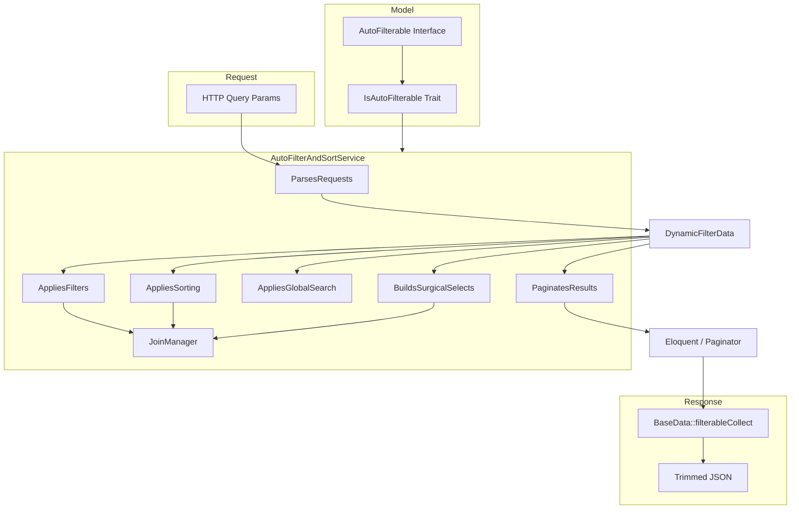

# DynamicFilters — Backend Architecture

How the DynamicFilters feature works internally: components, request flow, and SQL building.

---

## High-level diagram



---

## Package structure

```
DynamicFilters/
├── Contracts/
│   └── AutoFilterable.php      # Model contract (whitelist methods)
├── Data/
│   ├── BaseData.php            # Response JSON field pruning
│   ├── ColumnFilterData.php    # Single filter rule → SQL
│   ├── ColumnSortData.php      # Single sort rule → ORDER BY
│   └── DynamicFilterData.php   # Normalized request DTO
├── Enums/
│   ├── FilterFnsEnum.php       # Filter operators
│   └── PaginationFormateEnum.php
├── Services/
│   ├── AutoFilterAndSortService.php  # Main orchestrator
│   ├── JoinManager.php               # Relation JOIN aliases
│   └── Concerns/
│       ├── ParsesRequests.php
│       ├── BuildsSurgicalSelects.php
│       ├── AppliesFilters.php
│       ├── AppliesGlobalSearch.php
│       ├── AppliesSorting.php
│       └── PaginatesResults.php
├── Traits/
│   └── IsAutoFilterable.php    # Default whitelist implementations
└── docs/
```

---

## Request parameters reference

| Parameter | Type | Used by | Description |
|-----------|------|---------|-------------|
| `page` | int \| `all` | Pagination | Current page |
| `perPage` / `per_page` / `limit` | int \| `all` | Pagination | Items per page |
| `paginationFormate` | enum string | Pagination | `normal`, `separated`, `none`, etc. |
| `filters` | base64 JSON | AppliesFilters | Array of `{ id, value, filterFns }` |
| `sorting` | base64 JSON | AppliesSorting | Array of `{ id, desc }` |
| `advanceFilter` | base64 JSON | AppliesFilters | Nested rule tree |
| `globalFilter` | string | AppliesGlobalSearch | Free-text OR search |
| `fields` | comma string | **Both** | DB SELECT (service) + JSON prune (BaseData) |
| `except` | comma string | BaseData | JSON blacklist only |
| `count_only` | bool | Pagination | Return count without rows |
| Header `pdt: 0` | — | ParsesRequests | Disable pagination (fetch all) |

---

## Execution pipeline (`buildQuery`)

Order of operations in `AutoFilterAndSortService::buildQuery()`:

1. **Validate model** implements `AutoFilterable`
2. **Parse request** → `DynamicFilterData` (or use provided DTO)
3. **Initialize query** with table alias
4. **Surgical SELECT** — if not `count_only`, limit DB columns from `fields`
5. **Whitelist filters/sorts** — drop anything not in model definitions
6. **`beforeOperation` hook** — inject early constraints
7. **Advanced filters** — recursive AND/OR groups
8. **Column filters** — per-column rules (custom handlers, scopes, joins, whereHas)
9. **Global search** — OR across configured columns
10. **`extraOperation` hook** — e.g. eager load defaults
11. **Sorting** — ORDER BY with join resolution
12. Return `Builder`

`dynamicFilter()` then applies sorting (if deferred), pagination, and formats output.

---

## ParsesRequests — decoding URL data

### Filters & sorting encoding

Frontend sends JSON arrays encoded as:

1. JSON stringify
2. Optional gzip
3. Base64 (URL-safe variant supported on decode)

Example filter payload before encoding:

```json
[
  { "id": "is_active", "value": true, "filterFns": "equals" },
  { "id": "translation.title", "value": "decree", "filterFns": "contains" }
]
```

`smartDecode()` tries: base64 → JSON, then gzinflate, then gzdecode.

### Default CMS filters/sorts

When request has **no** filters/sorting, the service applies:

- `$model->cmsDefaultFilters()` — keyed by column id
- `$model->cmsDefaultSorts()` — array of `{ id, desc }` objects

---

## AppliesFilters — how a filter becomes SQL

For each `ColumnFilterData`:

```
1. Resolve alias via defineFieldSelectionMap()
2. Check custom handler (setCustomFilterHandlers)
3. Check model scope: scopeFilter{StudlyColumn} → filter{StudlyColumn}()
4. If dot-path (relation):
   a. BelongsTo/HasOne → JoinManager LEFT JOIN + WHERE on alias
   b. HasMany/MorphMany → whereHas subquery
   c. JSON column on main table → column->path syntax
5. Else → WHERE on main table column
```

### Advanced filter tree

Structure:

```json
{
  "condition": "AND",
  "rules": [
    { "id": "is_active", "value": 1, "filterFns": "equals" },
    {
      "condition": "OR",
      "rules": [
        { "id": "number", "value": "100", "filterFns": "startsWith" },
        { "id": "date", "value": "2024", "filterFns": "yearEquals" }
      ]
    }
  ]
}
```

Each leaf rule goes through the same `handelFilterOne()` pipeline.

---

## AppliesGlobalSearch

Builds one big `WHERE (col1 LIKE ? OR col2 LIKE ? OR whereHas(...))`:

- **Base columns** from `defineGlobalSearchBaseAttributes()`
- **Related columns** from `defineGlobalSearchRelatedAttributes()`:
  ```php
  return [
      'translation' => ['title', 'summary'],
      'category'    => ['name'],
  ];
  ```
- **Full-text** — columns in `defineFullTextSearchableAttributes()` use `MATCH ... AGAINST`
- **`globaleFilterExtraOperation`** — optional callback to add custom OR clauses

---

## AppliesSorting

- Base columns: `{table}.{column} ASC|DESC`
- Relation columns (BelongsTo/HasOne only): join via `JoinManager`, then `ORDER BY alias.column`
- HasMany relation sorts are skipped (would be ambiguous)
- Custom: `scopeSort{StudlyColumn}($direction)`

Nulls are ordered last: `ORDER BY col IS NULL ASC, col DESC`.

---

## BuildsSurgicalSelects — DB-level field selection

When `?fields=id,title,category.name` is present:

- Maps API names via `defineFieldSelectionMap()`
- Adds `{main}.id` always (primary key)
- BelongsTo/HasOne columns → JOIN + SELECT alias
- HasMany/BelongsToMany → eager load relation instead of join
- Virtual fields → `defineVirtualFieldsDependencies()` pulls required columns/relations

> **Important:** The same `fields` query param is **also** read by `BaseData` for JSON output trimming. DB selection happens in the service; JSON pruning happens in the DTO layer.

---

## JoinManager

- Creates stable aliases: `t_category`, `t_category_translations`
- Long paths truncated with hash to avoid MySQL 64-char identifier limit
- Injects relation `where` constraints from Eloquent relation definitions
- Respects SoftDeletes on joined tables

Supported relation types for JOIN: BelongsTo, HasOne, HasMany, MorphOne, MorphMany, BelongsToMany, MorphToMany.

---

## BaseData — response JSON pruning

Separate from SQL. Runs **after** Eloquent → Spatie Data transformation.

### `fields` (whitelist)

```
?fields=id,title,category.name,values.title
```

| Pattern | Result |
|---------|--------|
| `title` | Top-level key only |
| `category.name` | `{ category: { name: "..." } }` |
| `values.title` | Each list item keeps only `title` |

### `except` (blacklist)

```
?except=translations,pdf_path,category.translations
```

Removes keys at any depth using dot paths.

### Combined

`fields` applied first, then `except` removes from the result.

### Recursion guard

`$isPruning` static flag prevents nested `BaseData` children from double-filtering.

---

## Pagination formats

| Enum | Response shape |
|------|----------------|
| `normal` | Laravel paginator as `data` |
| `separated` | `{ data: [...], pagination: { current_page, last_page, ... } }` |
| `normal_simple` | Simple paginator in `data` |
| `separated_simple` | Separated simple pagination |
| `none` | `{ data: Collection, pagination: null }` |
| `count_only` | `{ data: 42, pagination: null }` |

---

## Security model

1. **Whitelist filters/sorts** — unknown column ids silently dropped
2. **Whitelist relations** — only keys in `defineRelationships()` can be joined/loaded
3. **Sensitive columns excluded** — `IsAutoFilterable` skips password, tokens, etc. from auto-lists
4. **LIKE escaping** — `%`, `_`, `\` escaped in filter values
5. **Custom filter handlers** — explicit registration only via `setCustomFilterHandlers()`

---

## Caching

`dynamicSearchFromRequest(..., cacheDuration: 5)` caches results keyed by SQL + bindings + page/perPage.

Schema column lists cached 24h per table (`schema_columns_{table}`).

---

## Extension points

| Hook | When | Signature |
|------|------|-----------|
| `beforeOperation` | Before filters | `fn(Builder $q, array $ctx)` |
| `extraOperation` | After global search | `fn(Builder $q, array $ctx)` |
| `globaleFilterExtraOperation` | Inside global OR group | `fn(Builder $q, string $term)` |
| `setCustomFilterHandlers` | Per filter id | `['status' => fn($q, ColumnFilterData $f) => ...]` |
| `scopeFilter*` / `scopeSort*` | On model | Eloquent local scopes |
| `getFilterableExtra()` etc. | On model | Override trait defaults |
