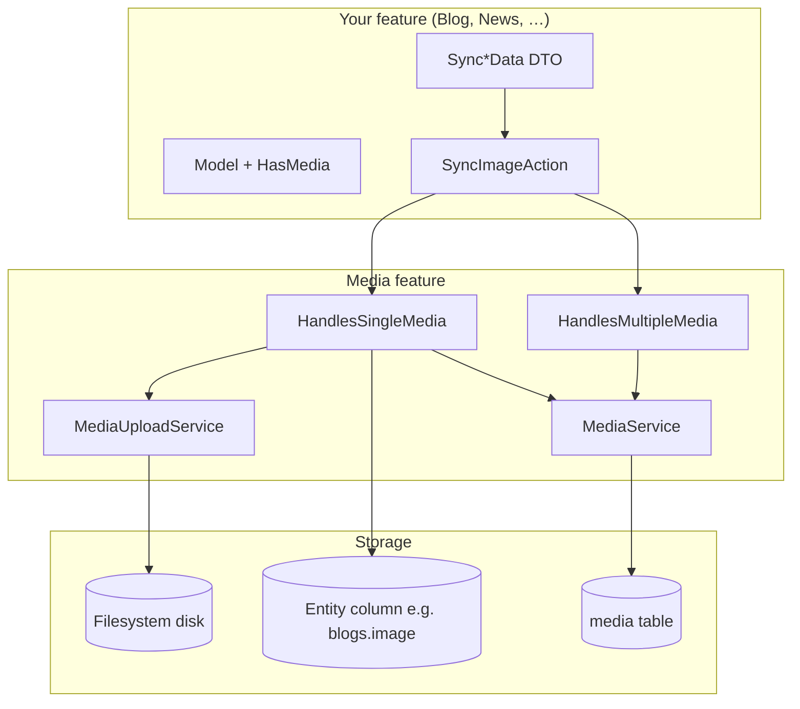

# Media

> **HMsoft Tools** — Upload, store, sync, and serve files for Laravel CMS/API projects.

Supports **two storage strategies**:

| Strategy | Storage | Best for |
|----------|---------|----------|
| **Column mode** | Path saved on model table (`blogs.image`) | Single image/PDF/icon per resource |
| **Polymorphic mode** | Rows in `media` table via `mediaList()` | Galleries, attachments, multi-file |

---

## Table of contents

1. [Overview](#overview)
2. [Two storage modes](#two-storage-modes)
3. [Setup checklist](#setup-checklist)
4. [Backend setup — Column mode (single file)](#backend-setup--column-mode-single-file)
5. [Backend setup — Polymorphic mode (gallery)](#backend-setup--polymorphic-mode-gallery)
6. [Usage — Upload / sync / delete](#usage--upload--sync--delete)
7. [Usage — URL & media objects](#usage--url--media-objects)
8. [Usage — Standalone Media API](#usage--standalone-media-api)
9. [Frontend integration](#frontend-integration)
10. [Configuration](#configuration)
11. [Database schema](#database-schema)
12. [Troubleshooting](#troubleshooting)
13. [Extended documentation](#extended-documentation)

---

## Overview



**Typical column-mode flow:**

```
POST /api/blogs/{id}/sync-image  (multipart)
  → SyncBlogImageData validates file
  → SyncImageAction → syncSingleImage()
  → MediaUploader::upload() → blogs/image.webp
  → blogs.image column updated
  → Response includes image_url via HasMedia magic accessor
```

---

## Two storage modes

| | Column mode | Polymorphic mode |
|---|-------------|------------------|
| **Detection** | Model table has the column (`image`, `pdf_path`) | Column does **not** exist on model table |
| **Storage** | Path string on entity row | `media` table row linked via morph |
| **Sync trait** | `HandlesSingleMedia` | `HandlesSingleMedia` or `HandlesMultipleMedia` |
| **Read URL** | `$model->image_url` (HasMedia) | `$medium->file_url` or `mediaList` relation |
| **Used in this project** | Blog, News, Decree, Sector, … | Legislation attachments, Complaint files, Media API |

---

## Setup checklist

```
Column mode (single image/PDF/icon)
[ ] 1. Model uses HasMedia trait
[ ] 2. Model: protected array $cmsMediaFields = ['image']
[ ] 3. Model: public const MEDIA_FOLDER = 'blogs'
[ ] 4. Entity table has column (e.g. image VARCHAR)
[ ] 5. Create Sync{Feature}ImageData with InteractsWithMediaRules
[ ] 6. Create SyncImageAction using HandlesSingleMedia
[ ] 7. Wire controller route + service method
[ ] 8. Response DTO: getMediaObject('image') or image_url accessor

Polymorphic mode (gallery / attachments)
[ ] 1. Model uses HasMedia (mediaList relation)
[ ] 2. Run media migrations (auto-loaded by provider)
[ ] 3. Create sync action with HandlesMultipleMedia OR use Media API
[ ] 4. Optional: register morph map alias for owner_type

Standalone Media API (optional)
[ ] 5. Morph map for owner_type in AppServiceProvider
[ ] 6. Routes: api/{owner_type}/{owner_id}/media
```

---

## Backend setup — Column mode (single file)

### Step 1 — Model

```php
use HMsoft\Tools\Features\Media\Traits\HasMedia;

class Blog extends Model
{
    use HasMedia;

    public const MEDIA_FOLDER = 'blogs';

    protected array $cmsMediaFields = ['image'];
    public string $cmsMediaSet = 'blog_items'; // optional — thumbnail srcset
}
```

| Property | Required | Description |
|----------|----------|-------------|
| `$cmsMediaFields` | ✅ | Column names treated as media (enables `image_url`, `image_object`) |
| `MEDIA_FOLDER` | ✅ | Storage subdirectory passed to upload |
| `$cmsMediaSet` | Optional | Key in `config('cms_media.image_sets')` for thumb/medium variants |
| `$cmsMediaDisk` | Optional | Override filesystem disk per model |
| `$cmsPlaceholder` | Optional | Placeholder URL when field is empty |
| `$cmsNoPlaceholder` | Optional | Return `null` instead of placeholder |

Legacy alias: `$mediaFields` works if `$cmsMediaFields` is not set.

### Step 2 — Sync DTO with validation

```php
use HMsoft\Tools\Features\Media\Traits\InteractsWithMediaRules;
use Spatie\LaravelData\Data;

class SyncBlogImageData extends Data
{
    use InteractsWithMediaRules;

    public function __construct(
        public readonly ?bool $delete_image = null,
        public readonly mixed $image = null,
    ) {}

    public static function rules(): array
    {
        return array_merge(
            ['image' => ['required_without:delete_image']],
            self::getSingleMediaRules('image'), // adds FileOrUrl + delete_image
        );
    }
}
```

`getSingleMediaRules('image')` adds:

- `image` — file upload **or** external URL (`FileOrUrl` rule)
- `delete_image` — boolean to remove existing file

### Step 3 — Sync action

```php
use HMsoft\Tools\Features\Media\Traits\HandlesSingleMedia;

class SyncImageAction
{
    use HandlesSingleMedia;

    public function execute(Blog $blog, SyncBlogImageData $data): array
    {
        $status = $this->syncSingleImage(
            model: $blog,
            file: $data->image ?? null,
            field: 'image',
            deleteImage: (bool) ($data->delete_image ?? false),
            folder: Blog::MEDIA_FOLDER,
        );

        return [
            'model'        => $blog->refresh(),
            'media_status' => $status, // 'uploaded' | 'deleted' | 'unchanged'
        ];
    }
}
```

### Step 4 — Response DTO

```php
// In BlogData::fromModel()
image: $blog->getMediaObject('image'),
image_url: $blog->image_url,
```

---

## Backend setup — Polymorphic mode (gallery)

### When column does not exist

`HandlesSingleMedia` automatically creates a `media` row via `MediaService::store()`.

### Multiple files — HandlesMultipleMedia

```php
use HMsoft\Tools\Features\Media\Traits\HandlesMultipleMedia;

class SyncFilesAction
{
    use HandlesMultipleMedia;

    public function execute(Legislation $legislation, ?array $files, array $deletedIds = []): void
    {
        $this->syncMultipleMedia(
            model: $legislation,
            files: $files ?? [],
            field: 'attachment',        // media_type slot name
            deletedIds: $deletedIds,
            folder: Legislation::MEDIA_FOLDER,
        );
    }
}
```

Gallery validation (optional):

```php
self::getGalleryRules('attachments');
// attachments.*.file, attachments.*.sort, deleted_attachments_ids
```

---

## Usage — Upload / sync / delete

### Use case 1 — Upload new image (column mode)

**Request:** `POST multipart/form-data`

```
image: (file)
```

**Result:** Old file deleted → new WebP stored → column updated → `media_status: "uploaded"`.

### Use case 2 — Upload via external URL

**Request:**

```
image: https://cdn.example.com/photo.jpg
```

Stored as URL string in column (no local file). `image_url` returns the URL directly.

### Use case 3 — Delete image

**Request:**

```
delete_image: true
```

**Result:** File removed from disk → column set to `null` → `media_status: "deleted"`.

### Use case 4 — Replace image on update

Sending a new `image` file automatically deletes the old file first (built into `uploadSingleImage`).

### Use case 5 — PDF / non-image file

Non-image extensions (pdf, doc, zip) are stored **without** WebP conversion via `storeRawFile()`.

### Use case 6 — Model deleted → cascade cleanup

`HasMedia::bootHasMedia()` on `deleting` / `forceDeleting`:

- Deletes all `$cmsMediaFields` files from disk
- Deletes all `mediaList` rows and their files

---

## Usage — URL & media objects

### Magic accessors (column mode)

| Access | Example | Returns |
|--------|---------|---------|
| `{field}_url` | `$blog->image_url` | Public URL for stored path |
| `{field}_url_{suffix}` | `$blog->image_url_thumb` | URL with `_thumb` before extension |
| `{field}_object` | `$blog->image_object` | `{ url, thumb, medium, srcset }` |

### getMediaObject() shape

```json
{
  "url": "https://example.com/storage/blogs/2024-01-01-abc.webp",
  "thumb": "https://example.com/storage/blogs/2024-01-01-abc_thumb.webp",
  "medium": "https://example.com/storage/blogs/2024-01-01-abc_medium.webp",
  "srcset": "https://.../_thumb.webp 150w, https://.../_medium.webp 600w"
}
```

Requires `$cmsMediaSet` matching a key in `config('cms_media.image_sets')`.

### Placeholders

When field is empty, `getMediaObject()` returns placeholder URLs from config unless `$cmsNoPlaceholder = true`.

---

## Usage — Standalone Media API

Registered at: **`/api/{owner_type}/{owner_id}/media`**

| Method | Route | Description |
|--------|-------|-------------|
| GET | `/` | List owner's media (DynamicFilters pagination) |
| POST | `/` | Upload single file |
| POST | `/bulk` | Upload multiple files |
| POST | `/bulk-update` | Update metadata batch |
| DELETE | `/bulk-delete` | Delete by IDs |
| GET | `/{medium}` | Show one |
| POST | `/{medium}` | Update file + metadata |
| DELETE | `/{medium}` | Delete one |

### Store single — multipart example

```http
POST /api/blog/5/media
Content-Type: multipart/form-data

file: (binary)
is_default: true
media_type: gallery
folder: blogs/5/gallery
locales[0][locale]: en
locales[0][title]: Hero image
locales[0][alt]: Blog hero
```

### List with field pruning

```http
GET /api/blog/5/media?fields=id,file_url,media_type,is_default&page=1&perPage=10
```

Uses `MediaData::filterableCollect()` (requires app `BaseData`).

> **Morph map:** `{owner_type}` must resolve via Laravel morph map or full class name. Register aliases in `AppServiceProvider` if using short names like `blog`.

---

## Frontend integration

### Single image upload (FormData)

```typescript
const formData = new FormData();
formData.append('image', file); // File from input

await fetch(`/api/blogs/${id}/sync-image`, {
  method: 'POST',
  body: formData,
  headers: { Authorization: `Bearer ${token}` },
});
```

### Delete image

```typescript
const formData = new FormData();
formData.append('delete_image', '1');

await fetch(`/api/blogs/${id}/sync-image`, { method: 'POST', body: formData });
```

### External URL instead of file

```typescript
formData.append('image', 'https://cdn.example.com/image.jpg');
```

### Display in React/Vue

```typescript
// From API response
const { url, thumb, srcset } = blog.image ?? blog.image_object;


```

### Polymorphic gallery upload

```typescript
const formData = new FormData();
files.forEach((file, i) => formData.append(`attachments[${i}][file]`, file));

await fetch(`/api/legislation/${id}/sync-files`, { method: 'POST', body: formData });
```

### Standalone Media API

Single file (`file` at the root):

```typescript
const formData = new FormData();
formData.append('file', file);
formData.append('media_type', 'video');
formData.append('is_default', 'false');

await fetch(`/api/blog/${blogId}/media`, { method: 'POST', body: formData });
```

One or more files (`media[0][file]`). Same `POST /media` URL, or `POST /media/bulk`:

```typescript
const formData = new FormData();
files.forEach((file, i) => {
  formData.append(`media[${i}][file]`, file);
  formData.append(`media[${i}][media_type]`, 'video');
  formData.append(`media[${i}][is_default]`, 'false');
});

await fetch(`/api/blog/${blogId}/media`, { method: 'POST', body: formData });
```

---

## Configuration

Publish config (optional):

```bash
php artisan vendor:publish --tag=cms_media-config
```

**`config/cms_media.php`:**

| Key | Env | Default | Description |
|-----|-----|---------|-------------|
| `disk` | `MEDIA_DISK` | `public` | Default upload disk |
| `max_image_dimension` | `MEDIA_MAX_IMAGE_DIMENSION` | `4096` | Max width/height before resize |
| `placeholders.default` | — | `assets/images/placeholder.png` | Fallback image |
| `placeholders.models` | — | `{ user: ... }` | Per-model placeholders |
| `placeholders.fields` | — | `{ icon: ... }` | Per-field placeholders |
| `image_sets` | — | `default`, `avatar` | Thumbnail size presets |

### Image sets example

```php
'image_sets' => [
    'blog_items' => [
        'thumb'  => ['width' => 150, 'height' => 150],
        'medium' => ['width' => 600, 'height' => null],
    ],
    'gallery_items' => [
        'thumb' => ['width' => 200, 'height' => 200],
    ],
],
```

Match `$cmsMediaSet = 'blog_items'` on your model.

### Environment

```env
MEDIA_DISK=public
MEDIA_MAX_IMAGE_DIMENSION=4096
FILESYSTEM_DISK=public
```

---

## Database schema

### `media` table

| Column | Type | Description |
|--------|------|-------------|
| `owner_id` | bigint | Polymorphic owner ID |
| `owner_type` | string | Morph class / alias |
| `file_path` | text | Storage path or external URL |
| `file_name` | string | Original filename |
| `mime_type` | string | MIME or `link` for URLs |
| `media_type` | string | Logical slot (`image`, `attachment`, `gallery`) |
| `sort_number` | int | Order in gallery |
| `is_default` | bool | Default media for owner |

### `media_translations` table

| Column | Description |
|--------|-------------|
| `medium_id` | FK → media |
| `locale` | Language code |
| `title`, `alt`, `short_description` | Metadata |

Migrations auto-load via `MediaServiceProvider`. Publish with `--tag=cms_media-migrations` if needed.

---

## Troubleshooting

| Problem | Solution |
|---------|----------|
| `image_url` is null | Check `$cmsMediaFields` includes `'image'`; column has path |
| Thumbnails / srcset missing | Define `$cmsMediaSet` + matching `image_sets` in config |
| Upload works but URL 404 | Run `php artisan storage:link`; check `MEDIA_DISK` |
| Placeholder wrong | Use `cms_media.placeholders.default` (not `default_placeholder`) |
| Media API 404 owner | Register morph map for `owner_type` |
| File not deleted on replace | Check disk matches `$cmsMediaDisk` / config |
| PDF uploaded as WebP | Non-images skip conversion — verify extension |
| `delete_image` ignored | Pass `delete_image: true` when no new file |
| `file required` on POST `/media` | Send either root `file` or `media[0][file]`. Do not mix the field names on the wrong shape. |

---

## Extended documentation

| Document | Description |
|----------|-------------|
| [docs/00-ANALYSIS-AND-NOTES.md](./docs/00-ANALYSIS-AND-NOTES.md) | Known issues & recommendations |
| [docs/01-BACKEND-ARCHITECTURE.md](./docs/01-BACKEND-ARCHITECTURE.md) | Internal workflow & classes |
| [docs/02-BACKEND-INTEGRATION.md](./docs/02-BACKEND-INTEGRATION.md) | Step-by-step integration |
| [docs/03-FRONTEND-GUIDE.md](./docs/03-FRONTEND-GUIDE.md) | Frontend upload & display |
| [docs/04-SETUP-CHECKLIST.md](./docs/04-SETUP-CHECKLIST.md) | Printable checklist |
| [docs/05-COMPLETE-API-REFERENCE.md](./docs/05-COMPLETE-API-REFERENCE.md) | Full API & trait reference |

---

## License

Part of **HMsoft Tools** — internal Laravel package.
