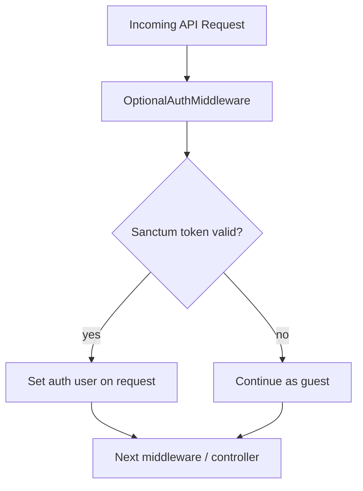

# OptionalAuth

> **HMsoft Tools** — Authenticate the user when a token is present, but **never block** the request when it is missing.

Enables **public API endpoints** that behave differently for guests vs logged-in users — without requiring `Authorization` on every request.

---

## Table of contents

1. [Overview](#overview)
2. [Optional vs required auth](#optional-vs-required-auth)
3. [Setup checklist](#setup-checklist)
4. [Backend setup](#backend-setup)
5. [Usage patterns](#usage-patterns)
6. [Use cases in this project](#use-cases-in-this-project)
7. [Frontend integration](#frontend-integration)
8. [Middleware priority](#middleware-priority)
9. [Troubleshooting](#troubleshooting)
10. [Extended documentation](#extended-documentation)

---

## Overview

| Middleware | Behavior |
|------------|----------|
| `auth:sanctum` | **Required** — 401 if no valid token |
| `optional.auth` / `OptionalAuthMiddleware` | **Optional** — sets user if token valid; guest if not |



**Typical scenario:**

```http
# Guest — works, no Authorization header
GET /api/blogs

# Logged-in user — same endpoint, extra personalized fields
GET /api/blogs
Authorization: Bearer {sanctum_token}
```

---

## Optional vs required auth

| Layer | Middleware | When to use |
|-------|------------|-------------|
| **Global (all API)** | `OptionalAuthMiddleware:sanctum` | Try auth on every API request |
| **Route group** | `optional.auth:sanctum` | Per-route optional auth |
| **Protected routes** | `auth:sanctum` | Login, profile, favorites — must be authenticated |
| **Permission routes** | `permission:feature` | CMS write ops — requires user + permission |

**Rule of thumb:**

- **Read/public endpoints** → rely on global optional auth (no extra middleware)
- **Write/admin/user-specific actions** → add `auth:sanctum` or `permission:*`

---

## Setup checklist

```
[ ] 1. Register OptionalAuthServiceProvider in bootstrap/providers.php
[ ] 2. Register middleware alias optional.auth in bootstrap/app.php
[ ] 3. Append OptionalAuthMiddleware:sanctum to api middleware group
[ ] 4. Set middleware priority (before SubstituteBindings)
[ ] 5. Use auth()->user() / auth()->id() in code — handle null for guests
[ ] 6. Protect sensitive routes with auth:sanctum or permission middleware
[ ] 7. Frontend: send Bearer token when user is logged in (optional on public GET)
```

---

## Backend setup

### Step 1 — Service provider

`bootstrap/providers.php`:

```php
\HMsoft\Tools\Features\OptionalAuth\Providers\OptionalAuthServiceProvider::class,
```

### Step 2 — Register middleware (`bootstrap/app.php`)

```php
use HMsoft\Tools\Features\OptionalAuth\Middleware\OptionalAuthMiddleware;

->withMiddleware(function (Middleware $middleware): void {
    // Apply to ALL api routes — try sanctum auth, guest OK
    $middleware->api(append: [
        OptionalAuthMiddleware::class . ':sanctum',
        'zero.trust',
        'set.locale',
    ]);

    // Alias for per-route use
    $middleware->alias([
        'optional.auth' => OptionalAuthMiddleware::class,
    ]);

    // Run BEFORE route model binding
    $middleware->priority([
        OptionalAuthMiddleware::class,
        \Illuminate\Routing\Middleware\SubstituteBindings::class,
    ]);
})
```

### Step 3 — Per-route optional auth (alternative)

If not global, apply to specific groups:

```php
Route::middleware('optional.auth:sanctum')->group(function () {
    Route::get('/blogs', [BlogController::class, 'index']);
    Route::get('/blogs/{blog}', [BlogController::class, 'show']);
});
```

### Step 4 — Protect write routes separately

```php
// Public read (optional auth from global middleware)
Route::get('/', [BlogController::class, 'index']);

// CMS write — requires auth + permission
Route::post('/', [BlogController::class, 'store'])
    ->middleware('permission:blog');
```

---

## Usage patterns

### Pattern 1 — Check if user is logged in

```php
if (auth()->check()) {
    // personalized logic
}

$user = auth()->user(); // null for guests
$userId = auth()->id(); // null for guests
```

### Pattern 2 — Personalized response field

```php
// IsFavoritedResolver — returns false for guests
public static function forModel(Model $model): bool
{
    $userId = auth()->id();
    if (!$userId) {
        return false;
    }
    return Favorite::query()->where('user_id', $userId)->...->exists();
}
```

Used in `BlogData`, `DecreeData`, etc. for `is_favorited` field.

### Pattern 3 — Guest vs admin data visibility

```php
// ApplyActiveScopeForNotAdmin trait
protected function resolveActiveScopeCondition(): bool
{
    $user = Auth::user();
    // Guest OR non-admin → hide inactive records
    return !$user || !$user->typeIs(UserType::ADMIN);
}
```

- **Guest** → only `is_active = true` records
- **Admin** → all records (including inactive)

### Pattern 4 — `$request->user()` in middleware

```php
// CheckFeaturePermission — requires user (NOT optional)
$user = $request->user();
if (!$user) {
    abort(401, 'Unauthorized');
}
```

Use `permission:` middleware only on routes that must reject guests.

---

## Use cases in this project

| Use case | Guest behavior | Authenticated behavior |
|----------|----------------|------------------------|
| `GET /api/blogs` | List active blogs | Same + `is_favorited` per item |
| `GET /api/decrees/{id}` | Active decree detail | Same + favorites flag |
| `GET /api/blogs` (admin token) | N/A — admin sees inactive too | All records via `ApplyActiveScopeForNotAdmin` |
| `POST /api/blogs` | 401 via `permission:blog` | Allowed if permission granted |
| `GET /api/auth/user` | 401 via `auth:sanctum` | Returns user profile |
| `GET /api/favorites` | 401 via `auth:sanctum` | User favorites list |

### Route examples from this app

**Public read (optional auth only):**

```php
// app/Features/Blog/Blog/Routes/api.php
Route::prefix('blogs')->group(function () {
    Route::get('/', [BlogController::class, 'index']);
    Route::get('/{blog}', [BlogController::class, 'show']);
    // write routes have no sanctum here — permission middleware on group if added
});
```

**Permission-protected CMS:**

```php
// app/Features/Decree/Decree/Routes/api.php
Route::prefix('decrees')->group(function () {
    Route::get('/', ...);
    Route::post('/', ...);
})->middleware('permission:decree');
```

**Strict auth required:**

```php
// app/Features/Identity/Routes/api.php
Route::middleware('auth:sanctum')->group(function () {
    Route::get('user', [AuthController::class, 'user']);
    Route::post('logout', [AuthController::class, 'logout']);
});
```

---

## Frontend integration

### Public page — no token

```typescript
// Works without login
const res = await fetch('/api/blogs?page=1&perPage=10');
const { data } = await res.json();
// is_favorited will be false for all items
```

### Same page — logged-in user

```typescript
const res = await fetch('/api/blogs?page=1&perPage=10', {
  headers: {
    Authorization: `Bearer ${accessToken}`, // optional but enables personalization
  },
});
// is_favorited reflects user's favorites
```

### Axios interceptor pattern

```typescript
axios.interceptors.request.use((config) => {
  const token = localStorage.getItem('access_token');
  if (token) {
    config.headers.Authorization = `Bearer ${token}`;
  }
  return config;
});
```

Send token on **all** API calls when available — public endpoints use it; protected endpoints require it.

### When token is required

| Endpoint type | Token required? |
|---------------|-----------------|
| Public GET (blogs, news, decrees) | Optional |
| CMS POST/PUT/DELETE | Required + permission |
| `/api/auth/user`, profile | Required |
| `/api/favorites` | Required |

---

## Middleware priority

In this project, `OptionalAuthMiddleware` runs **before** `SubstituteBindings` so:

1. User is resolved early
2. Route model binding and controllers see correct `auth()->user()`
3. Global scopes (`ApplyActiveScopeForNotAdmin`) evaluate with correct user context

```
Request → OptionalAuth → zero.trust → set.locale → ... → Controller
```

---

## Troubleshooting

| Problem | Solution |
|---------|----------|
| `auth()->user()` always null with token | Check `Authorization: Bearer {token}` header; Sanctum config |
| Guest gets 401 on public GET | Remove `auth:sanctum` from that route; use optional auth only |
| Guest sees inactive records | Model should use `ApplyActiveScopeForNotAdmin` |
| Admin still sees only active | Token not sent or user type not ADMIN |
| `is_favorited` always false | Expected for guests; send token when logged in |
| Write endpoint open to public | Add `auth:sanctum` or `permission:*` middleware |

---

## Extended documentation

| Document | Description |
|----------|-------------|
| [docs/00-ANALYSIS-AND-NOTES.md](./docs/00-ANALYSIS-AND-NOTES.md) | Design notes & limitations |
| [docs/01-BACKEND-ARCHITECTURE.md](./docs/01-BACKEND-ARCHITECTURE.md) | How middleware works internally |
| [docs/02-BACKEND-INTEGRATION.md](./docs/02-BACKEND-INTEGRATION.md) | Step-by-step integration |
| [docs/03-FRONTEND-GUIDE.md](./docs/03-FRONTEND-GUIDE.md) | Token handling for public vs protected routes |
| [docs/04-SETUP-CHECKLIST.md](./docs/04-SETUP-CHECKLIST.md) | Printable checklist |
| [docs/05-COMPLETE-API-REFERENCE.md](./docs/05-COMPLETE-API-REFERENCE.md) | Middleware parameters & guard resolution |

---

## License

Part of **HMsoft Tools** — internal Laravel package.
